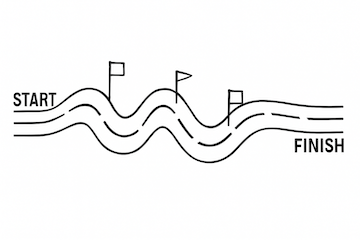

```{r}
#| label: setup
#| include: false
suppressPackageStartupMessages({
  library(simmer)
  library(dplyr)
  library(knitr)
  library(here)   # anchors source() paths to the repo root (des-resource-constraints.Rproj/.git)
})
# The model code lives in ../R/. We source() each model with here::here("R/model-N.R", chdir = TRUE)
# so each model's own bare source('inputs.R') etc. resolves against R/ regardless of the render CWD.
# Each model-N.R re-source()s inputs.R + main_loop.R and redefines des_run(), so sourcing a later
# model cleanly REPLACES the earlier definitions. Keep a seed in every stochastic chunk.
knitr::opts_chunk$set(collapse = TRUE)
```

::: {.callout-note}
## How to read this document
This is a *teaching build*. Each section adds **one** idea to the model. The full, tested code for
each step lives in a companion `model-N.R` file that we `source()` and run; inline we surface only
the **delta** — the new or changed function — heavily commented. Design rationale and the verified
`simmer` semantics behind the contention designs are in [`methodology.md`](methodology.md); the
section-by-section plan is in [`PLAN.md`](PLAN.md).
:::

# Orientation

This is the on-ramp, not the textbook. Before we build anything, we settle three
things: how to *read* a discrete-event simulation (DES) if your native language is
cost-effectiveness analysis (CEA), the two pictures we will lean on for the rest of
the document, and the one capability that makes the whole exercise worth the trouble —
contention. If a section here feels obvious, skip it; we return to each idea in code
later.

## Reading a DES as a CEA modeller

A DES is built out of a small handful of `simmer` nouns, and every one of them maps
cleanly onto something you already think about. The translation is worth committing
to memory, because the rest of the build is just these nouns acquiring detail.

```{r}
#| label: orientation-terminology
#| echo: false
tbl <- data.frame(
  `simmer term` = c(
    "trajectory", "environment (`env`)", "attribute", "event / `timeout`",
    "resource (capacity = `Inf`)", "resource (capacity = `c`)", "arrivals ledger"),
  `CEA reading` = c(
    "one patient's life history",
    "the health system the patients move through",
    "a patient's current health state (0 = H, 1 = S1, 2 = S2) and flags",
    "a transition firing after some sampled time",
    "a **costed counter** — a tally we seize/release only to integrate time-in-state",
    "a **genuinely finite, contended** resource patients must queue for",
    "the per-patient, per-state record we value *after* the run"),
  check.names = FALSE)
knitr::kable(tbl, caption = "The DES-to-CEA terminology map. The two resource rows are the whole story of this document.")
```

The two resource rows are the fork in the road. For models 1 through 7 every
"resource" is a **counter** with `capacity = Inf`: it can never be full, so seizing
it is instantaneous and exists purely so we can measure how long each patient spent
in health state 0 (H), 1 (S1), or 2 (S2) and attach costs and QALYs to that time.
Nothing is ever contended. From model 8 onward we introduce a resource with a real,
finite capacity `c` ≪ N — a fixed number of treatment slots — and now seizing it can
*fail*, because someone else is already in the chair. That single change is what DES
is for, and also where it bites back; the rest of Part II and the two designs that
follow are about getting it right.

::: {.callout-note}
## The vocabulary we reuse without re-explaining
Health states are **0-indexed numerics** throughout: `0 = H` (healthy),
`1 = S1` (sick), `2 = S2` (sicker). A **counter** is a `capacity = Inf` resource used
only for time-in-state costing — never for contention — *unless we deliberately
constrain it*. When we do constrain one, we say so loudly.
:::

## The car race: an intuition for contention

Picture a stock-car race. Each **driver** is a patient; the **track** is the health
system; **laps completed** are person-years lived. So far this is just a moving
population — drivers lap independently and nothing ties one car's fate to another's.

{#fig-car-race width=55%}

Contention enters when a car needs the **pit crew**. There is one mechanic (or `c`
mechanics), and a car that pulls in while the mechanic is busy with someone else must
*wait* — losing laps, possibly crashing out — until a bay frees up. Waiting for a
mechanic is exactly waiting for a treatment slot: the resource is finite, the queue
is real, and crucially **the race does not pause for the cars in line.**

{#fig-mechanic width=45%}

When demand for the bay outstrips supply, you get **congestion** — a pack of cars
backed up behind a bottleneck, each one's wait determined by how many are ahead of it.
That endogenous wait — *my* delay depends on *everyone else's* demand — is the thing a
patient-by-patient model cannot fake, and the thing this whole document is built to
capture faithfully.

{#fig-congestion width=50%}

::: {.callout-tip}
The two pillars of intuition we reuse throughout: the **car race** (patients =
drivers, waiting for a mechanic = waiting for a treatment slot) and the **Petri net**
(places, transitions, tokens, arcs), introduced next.
:::

## The Petri-net visual grammar

When we need to draw a model rather than describe it, we use a Petri net. It has
exactly four symbols, and we use them consistently from here to the end:

- **Place** — a labelled circle: a state a patient can occupy (H, S1, S2, or "in
  treatment").
- **Token** — a filled dot sitting inside a place: one patient, here, now.
- **Transition** — a bar: an event that moves a token from one place to another
  (incidence, recovery, death, seizing a slot).
- **Arc** — an arrow connecting a place to a transition or back: who can flow where.

{#fig-petri-place width=22%}

Contention has a precise Petri-net signature. A finite resource is a place with a
**limited number of token slots**. When more patients want it than it can hold, the
surplus tokens pile up *outside* the place — a visible **queue** waiting for the
transition to fire. That picture is the difference between a counter and a contended
resource, drawn:

{#fig-petri-token-queue width=55%}

The full Sick-Sicker model with one constrained treatment resource is our target
picture. Note the shaded "Constrained resource" box: a `Seize` transition gated by a
finite-capacity treatment place, a `Release` arc returning the slot, and — the part
that makes this hard — the disease transitions (death, progression, recovery,
end-of-horizon) that **must keep firing while a patient is in the queue.** Everything
between here and Part III is about reaching this diagram without breaking it.

{#fig-petri-model6 width=92%}

## Why DES, and not Markov or microsimulation

A cohort Markov model and a patient-level microsimulation can both reproduce the
*natural history* of Sick-Sicker perfectly well — states, transitions, costs, QALYs.
For models 1 through 9, DES buys us little a microsimulation would not. So why pay for
DES at all? Two things only DES gives cleanly:

1. **Queues and contention.** In a Markov or microsimulation model each patient's
   transition probabilities are fixed in advance; one patient's trajectory cannot
   depend on how many *other* patients are currently competing for a scarce resource.
   The endogenous wait of @fig-congestion — *my* delay is a function of the whole
   population's demand right now — is structurally outside what those frameworks
   express. It is exactly what DES exists to model.
2. **Exact event times.** DES works in continuous time: every transition fires at a
   precise, sampled instant, not at a fixed cycle boundary. That removes cycle-length
   bias entirely (no half-cycle correction), and it is what lets a contended resource
   be enforced *to the instant* a slot frees rather than to the nearest cycle.

So the honest framing for the build ahead: models 1–9 use DES as a clean, exact-time
microsimulation; the payoff that justifies the machinery only arrives at model 10, when
a downstream resource finally becomes finite and patients must queue for it.

## The cost of DES: a bouncer at an empty venue

DES is not free. Its event-driven engine — sample every competing time, take the
`argmin`, fire, reschedule — carries bookkeeping overhead that a vectorised cohort or
microsimulation does not. Empirically, runtime grows roughly **O(n log n)** in the
number of patients, and the constant is not small: the same Sick-Sicker model in
`simmer` is orders of magnitude slower than a base-R or `data.table` implementation,
with the gap widening sharply as N grows.

{#fig-des-vs-dt width=60%}

The lesson is one of fit-for-purpose. Running `simmer` on the *unconstrained* natural
history is like hiring a bouncer for an empty venue — paying for crowd control when
there is no crowd to control. You bring in DES precisely when there *is* a queue: a
genuinely finite resource that patients contend for. For everything before that, a
cheaper engine would do; we use DES throughout only so that the single mechanism
that *does* need it slots into machinery the reader already understands. (Practically,
this also caps N: keep cohorts modest in this document and quote production-scale
numbers in prose.)

::: {.callout-note}
## What we build, and in what order
**Part I** builds the cost-effectiveness model one idea per section — the engine
(model 1), valuation as a separate pass (model 2), the first competing risk
(model 3), the first disease state (model 4), recovery (model 5), and the full
Sick-Sicker ladder (model 6). **Part II** introduces the policy decision: model 7
adds a one-time *screening* program and establishes the molecular test as the
standard of care; model 8 introduces the cheaper *field test* as a comparator and —
ignoring downstream capacity — finds it dominant (cheaper *and* more effective).
Model 9 inserts an *exogenous* confirmatory wait and shows it gives false reassurance.
**Part III** makes the confirmatory bottleneck genuinely finite and models the queue
*endogenously*, two ways: the occupancy-coupled registry event (**A**, model 10) and
the claim-ticket companion (**B**, model 11). **Part IV** compares them, traces how
contention drifts the cost-effectiveness result out of the dominant quadrant, and
closes with guidance and limitations. Each section adds exactly one new idea; we
reference earlier ones rather than repeat them. Throughout we lean on **common random
numbers** so that the difference between two strategies is signal, not noise.
:::

# Part I — Building the cost-effectiveness model

## Model 1 — the engine and the empty patient

Every later model reuses the same six-part contract — `counters`, `initialize_patient()`,
`cleanup_on_termination()`, `terminate_simulation()`, an `event_registry`, and a `des_run()` wrapper.
`main_loop.R` is the hand-rolled next-event engine (`event_registry` → `next_event()` = argmin of
sampled times → `branch |> rollback`); we treat it as a black box and never edit it. At this stage
`simmer` is only a timeout/tally engine: the `time_in_model` "resource" has capacity `Inf` and exists
purely to record time-in-state for later costing — **not** to model contention. (That distinction is
the whole setup for Approaches A and B.)

```{r}
#| label: model-1-run
set.seed(1)
source(here::here("R/model-1.R"), chdir = TRUE)   # defines the 6-part contract + a single trivial "Terminate at horizon" event
arrivals <- des_run(inputs)
head(arrivals)
```

The single event in the registry is the trivial one:

```{r}
#| label: model-1-delta
#| eval: false
# THE DELTA: the registry holds exactly one (deterministic) event so the engine can be seen in
# isolation before any clinical events exist.
event_registry <- list(
  list(name          = "Terminate at time horizon",
       attr          = "aTerminate",
       time_to_event = function(inputs) inputs$horizon - now(env),
       func          = terminate_simulation,
       reactive      = FALSE)
)
```

::: {.callout-warning}
## The `function()`-callback gotcha
`set_attribute("AgeInitial", sample(20:30, 1))` samples **once at build time** (all patients get the
same value); `set_attribute("AgeInitial", function() sample(20:30, 1))` samples **per patient**. The
same rule governs per-patient wait and treatment-effect durations later — wrap them in `function()`.
:::

## Model 2 — valuation as a separate pass (costs, QALYs, discounting)

**Objective:** put numbers on the run. Model 1 ended with an *arrivals ledger* — one row per patient per resource, recording when each patient seized and released `time_in_model`. That ledger is the only thing a DES run produces. It says nothing yet about money or quality of life. Model 2 adds the idea that turns a ledger into a cost-effectiveness result, and it is deliberately a small idea: **valuation is a separate pass over the ledger, not part of the run.**

Nothing in the engine changes. We do not touch `main_loop.R`, the `event_registry` still holds only the trivial terminate-at-horizon event, and patients still do nothing but exist for 30 years. The only new code is two functions — `cost_arrivals()` and `qaly_arrivals()` — that take the finished ledger and append columns to it. `des_run()` simply pipes its result through them on the way out.

```{r}
#| label: model-2-run
#| collapse: true
set.seed(1)
source(here::here("R/model-2.R"), chdir = TRUE)            # same 6-part contract as Model 1, plus cost_arrivals() + qaly_arrivals()
arrivals <- des_run(inputs)    # N = 5 patients, horizon = 30 years
head(arrivals)
```

The ledger now carries four new columns. `cost` and `dcost` are undiscounted and discounted cost; `qaly` and `dqaly` are undiscounted and discounted quality-adjusted life-years. Costs are still zero — there are no costed events yet, so `cost_arrivals()` is a placeholder that writes `0`. But the QALY columns are already meaningful: with nobody dying and everybody healthy, each patient accrues one QALY per year of time-in-model. Their undiscounted `qaly` is therefore `end_time - start_time = 30`, and their discounted `dqaly` is `19.893`.

Two things are worth pausing on. First, the QALY total is computed *from the ledger*, by subtracting the seize time of `time_in_model` from its release time — exactly the time-in-state accounting the capacity-`Inf` counter was built to support in Model 1. Second, because valuation is a pure function of the ledger, it is **re-derivable at any time**: change a cost in `inputs.R`, or change the discount rate, and you re-value the *same* run rather than re-simulating it. That separation is what lets later models keep one expensive stochastic run and value it under several costing assumptions cheaply.

### The delta: two valuation functions

The whole of Model 2's new code is below. `qaly_arrivals()` is the part with content; `cost_arrivals()` is its still-empty twin, present so the shape is in place for Model 3 onward.

```{r}
#| label: model-2-delta
#| eval: false
# THE DELTA: valuation runs AFTER the simulation, over the arrivals ledger.
# des_run() ends with:  get_mon_arrivals(env, per_resource = TRUE) |> cost_arrivals(inputs) |> qaly_arrivals(inputs)

cost_arrivals <- function(arrivals, inputs)
{
  arrivals$cost  <- 0   # No costed events yet — placeholder.
  arrivals$dcost <- 0   # (discounted) likewise.
  arrivals
}

qaly_arrivals <- function(arrivals, inputs)
{
  arrivals$qaly  <- 0
  arrivals$dqaly <- 0

  # One QALY per year spent in the model. Select the time_in_model rows...
  selector <- arrivals$resource == 'time_in_model'

  # ...undiscounted QALYs = elapsed time in that resource (release - seize):
  arrivals$qaly[selector]  <- arrivals$end_time[selector] - arrivals$start_time[selector]

  # ...discounted QALYs = the analytic integral of a discounted unit rate
  #    over [start_time, end_time]; see discount_value() below.
  arrivals$dqaly[selector] <- discount_value(1, arrivals$start_time[selector],
                                                arrivals$end_time[selector])
  arrivals
}
```

The pattern to carry forward: every future state contributes its rows to this same selector-and-fill idiom. Add a state, and you add (i) a `cost`/`dcost` line and (ii) a `qaly`/`dqaly` line that selects that state's rows and values the time spent there. Nothing about *how* the run unfolds is touched; only what we read off it afterwards.

::: {.callout-note}
## Continuous discounting, and why the integral form

A health-economic convention discounts future value continuously rather than once at the end of each year. `discount.R`'s `discount_value()` does both jobs from one formula. Called with a single time point it returns a discounted *point* value; called with two it returns the *area under the discounted curve* between them — which is what we want for a QALY rate accruing over an interval.

It first converts the annual rate to a continuous rate, $r = -\log(1 + 0.03)$, then integrates a constant unit rate:

$$
\int_{t_A}^{t_B} e^{r t}\,dt \;=\; \frac{e^{r t_B} - e^{r t_A}}{r}.
$$

This closed form is used deliberately in place of the naive `value / (1 + rate)^t`: subtracting two exponentials is numerically stable across long horizons, where repeated powering drifts. A few values, all reproducible:

- `discount_value(1, 0)` $= 1$ — a unit at time zero is undiscounted.
- `discount_value(1, 30)` $\approx 0.412$ — a unit thirty years out is worth about 41p of a present unit.
- `discount_value(1, 0, 1)` $\approx 0.985$ — one QALY accrued *continuously* over the first year is worth slightly more than the naive end-of-year figure $1/1.03 \approx 0.971$, because some of it accrues early when discounting bites less.
- `discount_value(1, 0, 30)` $= 19.893$ — which is exactly the `dqaly` printed in the ledger above. The loop closes: the discounted lifetime QALY for a patient alive over $[0, 30]$ is the same integral, computed the same way.
:::

## Model 3 — the first competing risk (Death)

**Objective:** give the patient a way to leave before the horizon. Until now the registry held a single, deterministic event — "terminate at the horizon" — so `next_event()` had nothing to choose between: every patient ran the full 30 years. We now add a *second* registry entry, a random death time, and that one addition is what first switches the engine on. With two events in play, `next_event()` becomes a genuine `argmin`: it samples a death time, compares it against the remaining time to the horizon, and the earlier of the two wins.

This is the first true *competing risk*. In Petri-net terms, the healthy place now has two transition bars draining it — one to the empty place ∅ (death), one to the end of the simulation — and the patient's token fires through whichever bar comes up first.


### The event-per-file pattern

Each clinical event lives in its own small file that defines two functions: a `time_to_event` (when, in years, might this happen) and a `func` (what to do to the trajectory if it does). Here that file is `event_death.R`, and the registry entry simply names the pair. Sourcing `model-3.R` pulls it in and appends the entry to `event_registry`.

```{r}
#| label: model-3-run
set.seed(3)
source(here::here("R/model-3.R"), chdir = TRUE)                         # adds Death to the event registry
arrivals <- des_run(modifyList(inputs, list(N = 1000)))

# A "death" row now appears in the ledger, alongside time_in_model:
arrivals |> count(resource)

# Some patients leave before the 30-year horizon -- their time_in_model truncates:
arrivals |>
  filter(resource == "time_in_model") |>
  summarise(n          = n(),
            died_early = sum(end_time < 30 - 1e-6),
            max_end    = max(end_time))
```

Two things have changed in the ledger. First, a new `death` resource appears — these are the patients who hit the death transition, each marked exactly once. Second, for those patients `time_in_model` no longer runs the full horizon: it `end_time`s at the moment of death. Survivors still cap at 30. (At a production *N* the early-death fraction settles near 14%, consistent with the secular rate `r.HD = 0.005` compounded over 30 years.)

### The delta: `event_death.R`

The new file is short. Note the two pieces — a draw and a force-terminate.

```{r}
#| label: model-3-delta
#| eval: false
# THE DELTA: a self-contained event. A draw for *when*, a handler for *what*.

# When would this patient die a secular death? A single exponential draw.
# (A deliberately crude mortality model -- it is the H->D reference rate the
#  sicker states will later scale up via hazard ratios.)
years_till_death <- function(inputs)
{
  rexp(1, inputs$r.HD)
}

# What happens if Death wins the argmin? Mark the counter and force-terminate.
death <- function(traj, inputs)
{
  traj |> branch(
    function() 1,            # always take arm 1 -- this is not a real choice
    continue = c(FALSE),     # ...and do NOT continue the parent trajectory
    trajectory("Death") |>
      mark("death")     |>   # tally the death (must be listed in `counters`)
      terminate_simulation() # release time_in_model and end the patient
  )
}
```

And the one-line registry addition that activates the competition:

```{r}
#| label: model-3-registry-delta
#| eval: false
# The second entry. Now next_event() has two candidate times to compare.
event_registry <- list(
  list(name          = "Terminate at time horizon",
       attr          = "aTerminate",
       time_to_event = function(inputs) inputs$horizon - now(env),
       func          = terminate_simulation,
       reactive      = FALSE),
  list(name          = "Death",                 # <- NEW
       attr          = "aDeath",
       time_to_event = years_till_death,
       func          = death,
       reactive      = FALSE)
)
```

::: {.callout-note}
## The `branch(continue = FALSE)` force-terminate idiom
Killing a patient is the one place we use `branch()` for something other than branching. The selector `function() 1` always picks the single sub-trajectory, so this is not a real fork — it is a syntactic trick. The work is done by `continue = FALSE`, which tells `simmer` *not* to resume the parent trajectory after the sub-trajectory finishes. Without it, the patient would tally a death and then sail on through the rest of their event loop. The sub-trajectory itself just `mark()`s the `death` counter (which must appear in `counters`, exactly as `time_in_model` does) and calls `terminate_simulation()` to release the held counter cleanly. You will see this same `branch(continue = FALSE)` pattern every time a patient leaves the model for good.
:::

With a real competing risk in place, `next_event()`'s `argmin` is finally earning its keep. The next model adds the first *disease* state, so that the set of candidate events — and the death hazard itself — depends on where the patient currently sits.

## Model 4 — the first disease state, and reactive events

**Objective:** give the patient a place to *be* other than healthy or dead. Until now a patient was a token sitting in `healthy` until either the horizon or Death pulled them out. We now add the first disease state, **S1** (mildly sick), and with it the first thing that makes a microsimulation feel alive: a hazard that *changes when the patient's state changes*. That is what `reactive = TRUE` is for.

We continue to track state with the `State` attribute, **0-indexed**: `0 = H` (healthy), `1 = S1`. (Model 6 adds `2 = S2`.) The patient now has two competing risks racing at all times — Death and onset of S1 — plus the ever-present horizon. `next_event()` takes the argmin, exactly as before; nothing in `main_loop.R` changes.


### The four moving parts

**1. The new state, as an attribute and as a counter.** Becoming sick is a transition that flips the `State` attribute from `0` to `1`, releases the `healthy` counter, and seizes the `sick1` counter. The counter swap is what later lets the valuation pass integrate time-in-state (Model 2's machinery, unchanged): every patient leaves *one row per state they occupied*.

```{r}
#| label: model-4-delta-sick1
#| eval: false
# THE DELTA (event_sick1.R): onset is only possible from Healthy. From any other
# state we return a time past the horizon, which disables the transition.
years_till_sick1 <- function(inputs)
{
  state <- get_attribute(env, "State")
  if (state == 0)                 # 0 => Healthy: onset can happen
    rexp(1, inputs$r.HS1)         #   draw an onset time at rate r.HS1
  else
    inputs$horizon + 1            # already sick (or worse): never fires
}

sick1 <- function(traj, inputs)
{
  traj                      |>
  set_attribute("State", 1) |>    # 1 => S1; the state flip is the whole point
  release("healthy")        |>    # stop accruing the H tally...
  seize("sick1")                  # ...start accruing the S1 tally
}
```

**2. A state-dependent death hazard.** This is the clinically important part: sick patients die faster. The death event now reads the patient's state and multiplies the base rate by the S1 hazard ratio, `hr.S1D`.

```{r}
#| label: model-4-delta-death
#| eval: false
# THE DELTA (event_death2.R): death rate now depends on state.
years_till_death <- function(inputs)
{
  state <- get_attribute(env, "State")
  rate  <- inputs$r.HD                       # base healthy mortality
  if (state == 1) rate <- rate * inputs$hr.S1D   # in S1, die hr.S1D times faster
  rexp(1, rate)
}
```

**3. `reactive = TRUE` — the part that makes (2) work.** A hazard that depends on state is useless unless we *resample* it the moment the state changes. Consider a patient who, while healthy, drew a death time of (say) 40 years — comfortably past the horizon, so harmless. Then they become sick at year 7. Their mortality rate has just tripled, but that stale 40-year draw is still sitting in the `aDeath` attribute. If we did nothing, the patient would carry their *healthy* death time into a *sick* body.

Marking an event `reactive = TRUE` in the registry tells the engine to throw away and re-draw that event's time after **every** transition. The mechanism lives in `main_loop.R`'s `process_events()` (we do not edit it) — at the tail of each event it re-runs `time_to_event()` for every reactive event:

```{r}
#| label: model-4-reactive-pointer
#| eval: false
# main_loop.R, inside process_events() — runs after every event fires:
lapply(event_registry[sapply(event_registry, function(x) x$reactive)],
  FUN = function(e) {
    traj <- set_attribute(traj, e$attr,
              function() { now(env) + e$time_to_event(inputs) })  # re-draw from NOW
  })
```

Both Death and Sick1 are `reactive = TRUE`; only the horizon (which never depends on state) stays `reactive = FALSE`. The rule of thumb: **if a `time_to_event()` reads `State`, its event must be reactive.**

::: {.callout-warning}
## Reactive resampling is a memoryless-only convenience
Re-drawing the time from scratch at the transition is correct *because the underlying clocks are exponential* — `rexp` is memoryless, so a fresh draw from "now" is distributionally identical to having conditioned the original draw on survival to now. If you ever swap a `rexp` for a Weibull or a Gompertz, this shortcut silently introduces a bug: you would need to carry the *elapsed* time and condition on it, not re-draw afresh. Every clock in this build stays exponential precisely so that reactivity stays this cheap.
:::

**4. Per-state costs and utilities.** With two live states the valuation pass finally has something to discriminate. We extend `cost_arrivals()`/`qaly_arrivals()` with a selector for the new `sick1` rows, billing them at `c.S1` / `u.S1` instead of `c.H` / `u.H`:

```{r}
#| label: model-4-delta-valuation
#| eval: false
# THE DELTA: one more selector block per costed state (cost_arrivals / qaly_arrivals).
selector <- arrivals$resource == 'sick1'
arrivals$cost[selector]  <- inputs$c.S1 *
  (arrivals$end_time[selector] - arrivals$start_time[selector])
arrivals$qaly[selector]  <- inputs$u.S1 *
  (arrivals$end_time[selector] - arrivals$start_time[selector])
# (dcost / dqaly use discount_value() over the same interval, as in Model 2.)
```

### Run it

Sourcing `model-4.R` re-`source()`s the inputs and the engine, then redefines `des_run()` — so it cleanly replaces Model 3. We run a modest cohort and tally the rows by state. Every patient contributes one `time_in_model` row and one `healthy` row; the ~95% who fall sick add a `sick1` row; the third or so who die before the horizon add a `death` row.

```{r}
#| label: model-4-run
set.seed(8)
source(here::here("R/model-4.R"), chdir = TRUE)   # adds the State attribute, the reactive Sick1 event, and per-state cost/QALY
arrivals <- des_run(modifyList(inputs, list(N = 200)))
arrivals |>
  count(resource) |>
  knitr::kable(col.names = c("resource (state tally)", "rows"),
               caption = "One row per state occupied: 200 patients, 190 fell sick, 65 died before the horizon.")
```

### The random-audit idiom

A cohort summary tells you the model *ran*; it does not tell you the model is *right*. The single most useful validation habit in this whole build is to **pick one patient at random, sort their rows by time, and read their life story off the ledger** — checking that the chronology, the state sequence, and the per-state bills all make sense. We use this idiom in every model from here on.

```{r}
#| label: model-4-audit
set.seed(16)
one <- sample(unique(arrivals$name), 1)   # random-audit: one patient, picked blind
arrivals |>
  filter(name == one) |>
  arrange(start_time, end_time) |>        # read it top-to-bottom as a timeline
  select(resource, start_time, end_time, cost, qaly) |>
  knitr::kable(digits = 2, caption = paste("Audited life story:", one))
```

Read it as a sentence. `patient191` is healthy from year 0 to year **7.1** (one `healthy` row, costing `c.H` × 7.1 = 0 — healthy carries no disease-attributable cost in this calibration — while accruing 7.10 QALYs at `u.H` = 1.0). Onset of S1 fires at 7.1; from there to year **26.7** they are sick (one `sick1` row, billed at `c.S1` = 300 over 19.6 years ≈ 5,883, accruing 19.6 × `u.S1` = 15.69 QALYs). At **26.7** the (tripled, post-onset) death hazard finally wins, before the 30-year horizon. The `time_in_model` row spans the whole life, 0 to 26.7 — a free cross-check that the state rows tile the lifetime with no gaps and no overlap.

Three things to verify on every audit, all of which hold here:

- **Chronology is contiguous.** Each state's `end_time` is the next state's `start_time`; there are no gaps (uncounted time) and no overlaps (double-counted time). The `time_in_model` span equals the lifetime.
- **The state sequence is legal.** `healthy → sick1 → death` is a path the registry actually permits. A patient showing `sick1` *before* `healthy`, or a `cost` on a `death`/`time_in_model` row, would betray a wiring bug.
- **The per-state bills match the parameters.** A `sick1` row at `c.S1` not `c.H`; a QALY equal to duration × the right utility weight. Here the S1 QALYs (15.69) are visibly less than the S1 duration (19.6 years) — exactly the `u.S1` = 0.80 penalty for being sick.

::: {.callout-tip}
The `arrange(start_time, end_time)` tie-break is why `time_in_model` (which also starts at 0) sorts *after* `healthy`: both begin at time 0, and the tie is broken by `end_time`. Sorting on the start time alone leaves zero-width events (`death`, fired at a single instant) and equal-start rows in an arbitrary order — sort on both, and the timeline reads cleanly every time.
:::

With one disease state and a reactive, state-dependent death hazard in place, the model is a genuine two-state microsimulation. The next two steps make it a *recurrent* one — recovery back to health (Model 5), then progression onward to Sicker (Model 6) — but the audit idiom you just learned is the tool you will reach for to confirm each of them behaves.

## Model 5 — recurrence (recovery S1 → H)

**Objective:** add a single reactive event so that being sick is no longer a one-way trip. Until now the
disease has run downhill only — a healthy patient could fall sick (Model 4), but once in S1 the only exits
were death or the horizon. Real disease histories are rarely so tidy: people get better, relapse, and get
better again. We make recovery a first-class transition, `S1 → H`, and in doing so turn the one-way cascade
into a **recurrent, bidirectional loop** between the two states.

Mechanically this is one more registry entry. The work we did in Model 4 — the `State` attribute, reactive
resampling, per-state hazards and costing — already gives us everything we need to *receive* a returning
patient. So this section is short by design: the engine does not change, only the registry grows.


### The delta: a fourth (reactive) registry entry

Recovery needs the same two pieces every clinical event has had since Model 3: a `time_to_event()` that
samples *when* the patient would recover, and a `func()` that updates the patient when recovery *fires*.
The new file `event_healthy.R` supplies both, and `model-5.R` adds them as the fourth event in the
registry. Nothing else moves.

```{r}
#| label: model-5-delta
#| eval: false
# THE DELTA (event_healthy.R): the mirror image of years_till_sick1().
# Recovery is only possible *from* S1, so the time_to_event is STATE-GATED:
# if the patient is not in S1, we return a time past the horizon, which makes
# this transition effectively unreachable from any other state.
years_till_healthy <- function(inputs)
{
  state <- get_attribute(env, "State")
  if (state == 1) {           # 1 => S1: recovery is on the table
    rexp(1, inputs$r.S1H)     #   sample a recovery time at the S1 -> H rate
  } else {
    inputs$horizon + 1        # not in S1: return a time the engine will never pick
  }
}

# When recovery fires, flip the patient back to Healthy and move the costing
# token: release the 'sick1' counter, seize 'healthy'. (Same accounting move as
# sick1(), run in reverse.)
healthy <- function(traj, inputs)
{
  traj                      |>
  set_attribute("State", 0) |> # 0 => H
  seize('healthy')          |>
  release('sick1')
}

# ...and in model-5.R the registry gains its fourth, reactive entry:
event_registry <- list(
  # ... Terminate, Death, Sick1 as before ...
  list(name          = "Healthy",
       attr          = "aHealthy",
       time_to_event = years_till_healthy,
       func          = healthy,
       reactive      = TRUE)   # resample on every state change, like its siblings
)
```

::: {.callout-note}
## The state-gated `time_to_event` idiom (`return horizon + 1`)
This is the pattern that lets one flat registry describe a state machine. Every reactive event is *always*
in the registry, but each one **disables itself** when the current state cannot take that transition by
returning a time past the horizon (`inputs$horizon + 1`). Because `next_event()` is the argmin over all
sampled times, an event scheduled past the horizon can never win — the horizon-termination event will
always fire first — so the transition is silently switched off. `years_till_sick1()` gates on `state == 0`
(you can only fall sick from H); `years_till_healthy()` gates on `state == 1` (you can only recover from
S1). The two are mirror images. As we add states in Model 6, the same trick keeps each transition wired to
exactly the states it is legal from — no separate per-state registries, just guarded draws.
:::

Note the `reactive = TRUE` flag. The same Model 4 machinery that resamples a patient's death time when
their hazard changes also resamples their recovery time the instant they enter S1: until then
`years_till_healthy()` was returning `horizon + 1` (recovery off), and the moment `sick1()` sets `State`
to 1 the reactive pass redraws it as a live `rexp(1, r.S1H)` (recovery on). The competing risks now race
*both ways*.

### Run it, and audit a patient who bounces

A one-way cascade is hard to see in a ledger — every patient's `healthy`/`sick1` history is monotone. A
recurrent loop is unmistakable: a single patient visits the `healthy` counter, then `sick1`, then
`healthy` again. We borrow the random-audit idiom from Model 4 — run the model, pick one patient, order
their ledger by time — but now we deliberately select a patient who *recovered*, i.e. one with more than
one healthy spell.

```{r}
#| label: model-5-run
set.seed(8)
source(here::here("R/model-5.R"), chdir = TRUE)   # re-sources inputs.R + main_loop.R, redefines des_run; adds the Healthy event
arrivals <- des_run(modifyList(inputs, list(N = 200)))

# A patient who recovers visits the 'healthy' counter more than once.
# Pick one with exactly three healthy spells: enough bounces to see the loop,
# few enough to read at a glance.
spells <- arrivals |>
  dplyr::filter(resource == "healthy") |>
  dplyr::count(name, name = "healthy_spells") |>
  dplyr::filter(healthy_spells == 3)

who <- spells$name[1]
cat("Auditing:", who, "\n")

# Order this patient's state history by time: the H <-> S1 alternation is the recurrence.
arrivals |>
  dplyr::filter(name == who, resource %in% c("healthy", "sick1")) |>
  dplyr::arrange(start_time) |>
  dplyr::transmute(state = ifelse(resource == "healthy", "H", "S1"),
                   start = round(start_time, 2),
                   end   = round(end_time, 2),
                   years = round(end_time - start_time, 2)) |>
  print(row.names = FALSE)
```

Read the `state` column top to bottom: it **alternates** between `H` and `S1` several times — the recovery
loop firing. This patient is healthy for the first several years, endures a long sick spell (recovery is
slow, so S1 stays are long in this calibration), then recovers, relapses briefly, and recovers again before
the horizon. The contiguous `start`/`end` times confirm the costing token is being handed off cleanly at
each transition — `release('sick1')` exactly when `seize('healthy')` happens, so no overlap and no gap, and
the per-state cost and QALY selectors from Model 4 will bill each spell at the right rate with no further
change. The loop closes; the patient genuinely moves both ways.

::: {.callout-tip}
## A quick sanity reflex
Recurrence is also a good moment to glance at the population, not just one patient. Here recovery
(`r.S1H = 0.05`/yr) is *slower* than onset (`r.HS1 = 0.15`/yr) — a deliberate choice for the cancer
context, where pre-clinical disease rarely resolves — so patients accumulate in S1: across the cohort,
more person-time is spent sick than healthy (here ≈ 3,085 S1-years vs ≈ 2,120 H-years). What the audit
confirms is that the recovery arc nonetheless *fires* — roughly half the cohort returns to H at least once.
The tell-tale bug would be the opposite: *no* patient ever leaving S1, the sign of a mis-gated
`time_to_event` (recovery left permanently disabled). That most S1 patients now progress rather than
recover is exactly what motivates the screening question in Part II.
:::

With H ↔ S1 now a working two-state loop, Model 6 extends the *same* pattern one rung further down the
ladder — adding Sicker (S2) below S1 — and distils the moves we just made into a reusable checklist for
introducing any new state.

## Model 6 — the full ladder (Sicker / S2)

**Objective:** add the second disease state — *Sicker* (`S2`, numeric state `2`) — and, in doing so, discover that the model has stopped growing in kind. Everything new in Model 6 is a copy of a pattern we already have. The disease ladder is now complete (`H → S1 → S2`), and the rest of the build will reuse, not extend, the machinery assembled so far.

By now the shape of "adding a state" should feel familiar: Model 4 introduced `S1` and the reactive resampling that makes the engine notice a changed hazard; Model 5 added the recovery arc `S1 → H` and the state-gating idiom (`return horizon + 1` to switch a transition off). Adding `S2` asks nothing new of you. It is purely additive — five small, mechanical edits, each in a place we have touched before.

::: {.callout-tip}
## The 5-place checklist for adding a state

Whenever you add a state to one of these models, you touch exactly five places. Nothing else.

1. **A new event file** — the `years_till_*()` time-to-event sampler (state-gated) plus the `*()` transition that flips the `State` attribute and swaps the costing counter. Here: `event_sick2.R`.
2. **A registry entry** — one `list(...)` in `event_registry`, `reactive = TRUE`, pointing the engine at the new sampler and transition.
3. **A counter** — one string in the `counters` vector, so the `Inf`-capacity resource exists to tally time-in-state for costing.
4. **A cost/QALY selector** — one `selector <- arrivals$resource == 'sick2'` block in each of `cost_arrivals()` and `qaly_arrivals()`, applying `c.S2` / `u.S2`.
5. **A cleanup branch arm** — one more arm in `cleanup_on_termination()`'s `branch()` so a patient who dies (or hits the horizon) while in `S2` releases the right counter.

If you find yourself editing `main_loop.R` to add a state, stop: you have left the additive path.
:::

Walking the checklist for `S2`: `model-6.R` swaps in `source('event_sick2.R')` (item 1) and the matching `list(name = "Sick2", ...)` registry entry (item 2); the `counters` vector gains `"sick2"` (item 3); both valuation passes gain a `'sick2'` selector keyed to `c.S2` / `u.S2` (item 4); and the cleanup `branch()` gains its third arm, `trajectory() |> release("sick2")` (item 5). The Petri-net picture is just Model 5's with one more place and one more transition arc bolted on the far end.


### Run it

Sourcing `model-6.R` cleanly replaces the Model 5 definitions. The visible payoff is a *fifth* state-resource in the ledger — `sick2` — which simply was not reachable before.

```{r}
#| label: model-6-run
set.seed(6)
source(here::here("R/model-6.R"), chdir = TRUE)   # the full ladder: adds the Sicker (S2) state
arrivals <- des_run(modifyList(inputs, list(N = 200)))

# The ledger now carries a fifth state-resource, 'sick2':
sort(unique(arrivals$resource))
```

### The delta: `event_sick2.R`

The new event file is a near-verbatim cousin of `event_sick1.R`. The sampler fires only out of `S1` (state `1`); the transition flips `State` to `2`, releases the `sick1` counter, and seizes `sick2`. There is no recovery arc out of `S2` in this model — once Sicker, a patient stays Sicker until death or the horizon — so there is no `S2 → S1` or `S2 → H` event to write.

```{r}
#| label: model-6-delta-sick2
#| eval: false
# THE DELTA (event_sick2.R): identical in shape to event_sick1.R, one rung up the ladder.

# State-gated sampler: a draw to S2 is only meaningful while in S1.
years_till_sick2 <- function(inputs)
{
  state <- get_attribute(env, "State")
  if (state == 1)             # 1 => Sick1: progression is possible
  {
    rexp(1, inputs$r.S1S2)    # competing-risk draw, rate r.S1S2 per year
  } else
  {
    inputs$horizon + 1        # any other state: disable this transition
  }
}

# Transition: flip the state, swap the costing counter (sick1 -> sick2).
sick2 <- function(traj, inputs)
{
  traj                      |>
  set_attribute("State", 2) |> # 2 => Sicker (S2)
  release('sick1')          |> # stop tallying S1 time...
  seize('sick2')               # ...start tallying S2 time
}
```

### The compounding death hazard

There is one substantive change hiding in the additive work, and it lives in the death sampler, not in `event_sick2.R`. Model 6 pairs with `event_death3.R` (not the `event_death2.R` of Model 5): the only edit is a third line in the state-dependent rate.

```{r}
#| label: model-6-delta-death
#| eval: false
# THE DELTA (event_death3.R): one new line for the S2 hazard ratio.
years_till_death <- function(inputs)
{
  state <- get_attribute(env, "State")
  rate  <- inputs$r.HD
  if (state == 1) rate <- rate * inputs$hr.S1D  # Model 4: S1 raises the hazard
  if (state == 2) rate <- rate * inputs$hr.S2D  # NEW: S2 raises it much further
  rexp(1, rate)
}
```

With `hr.S1D = 3` and `hr.S2D = 60`, the per-year death rate climbs from `r.HD = 0.005` in `H`, to `0.015` in `S1`, to `0.30` in `S2` — a sixtyfold gap between the ends of the ladder. `S2` is the deadly, advanced state: a hazard of 0.30/yr means a mean survival of only about three years once a patient reaches it. Because Death is a `reactive = TRUE` event, the engine resamples `years_till_death` the instant a patient enters `S2`, so the steeper hazard takes effect immediately rather than at the next scheduled draw. This is the engine quietly earning its keep: the hand-rolled resampling logic from Model 4 is what makes a *compounding* hazard correct here, with no extra code in the death event itself.

### Audit a patient who reaches S2

The random-audit idiom from Model 4 transfers unchanged — sample one patient, order their rows by time, and read the trajectory. We filter to a patient who actually climbed to `S2` so the new rung is exercised.

```{r}
#| label: model-6-audit
# Re-run under the SAME seed so the audit lands on a known patient.
set.seed(6)
source(here::here("R/model-6.R"), chdir = TRUE)
arrivals <- des_run(modifyList(inputs, list(N = 200)))

# Pick one patient who climbed all the way to S2, then read their history in order.
set.seed(11)
who <- arrivals |>
  dplyr::filter(resource == "sick2") |>
  dplyr::distinct(name) |>
  dplyr::slice_sample(n = 1) |>
  dplyr::pull(name)

arrivals |>
  dplyr::filter(name == who, resource != "time_in_model") |>
  dplyr::arrange(start_time) |>
  dplyr::transmute(resource,
                   start_time = round(start_time, 1),
                   end_time   = round(end_time, 1),
                   cost       = round(cost)) |>
  knitr::kable(caption = paste("State history for", who))
```

Read top to bottom, this is the whole curriculum so far in one patient: `H → S1 → S2 → death`. The patient is healthy briefly, spends a few years in S1, then progresses to `S2` — and, with no recovery arc out of S2 and a sixtyfold death hazard, dies within a few years of reaching it, long before the 30-year horizon. The `sick2` row (billed at `c.S2 = 1000`/year) is short but it is where the lost life-years concentrate: advanced disease here is cheap to *manage* but expensive in *health*. It is exactly this cohort — the patients who progress to deadly S2 because they were never treated early — that the screening question in Part II is about reaching in time.

::: {.callout-note}
## Why this is the last "add a state" section
Models 4–6 were three turns of one crank: state attribute, reactive resampling, state-gated samplers, per-state costing, cleanup arm. The ladder `H → S1 → S2` is now complete and validated patient-by-patient. From here the build changes character — Model 7 adds a *comparator* (and the first ICER), and Part II replaces an `Inf`-capacity counter with a genuinely finite one. No new disease states are coming; the machinery is done.
:::

# Part II — A screening decision

Part I built a faithful natural history: a cohort flows `H → S1 → S2`, recovers
occasionally, and dies — and we can price the result in discounted costs and QALYs.
Nothing in it was contended; `simmer` was only a timeout-and-tally engine. We now put
that model to work on a concrete policy question, and in doing so introduce the one
ingredient Part I lacked: a resource that more than one patient wants at once.

::: {.callout-note}
## The decision (the Republic of SMDM)
A lower-middle-income country screens for a cancer with a long pre-clinical phase
(our `S1`). The **standard of care** is an accurate **molecular test** — high
sensitivity and specificity — but it needs cold chain, imported cartridges, and a
laboratory, so it is expensive and reaches only about **12 %** of eligible people.
A challenger has appeared: a cheap **field test** a primary-care nurse can run, at
roughly one-twelfth the cost, which could reach **50 %** — but it is less accurate
(more missed cancers, *many* more false alarms). Every screen-positive, true or
false, must be **confirmed** by a diagnostic workup before treatment, and that
confirmatory capacity is **fixed**. The question the rest of this document answers:
*does the field test's flood of referrals overwhelm the bottleneck, and does that
change the recommendation?*
:::

We reach the answer in four steps. Model 7 turns disease into a *decision* by adding a
screening program and establishing the molecular test as the standard of care. Model 8
introduces the field test as a comparator and — ignoring capacity — finds it dominant.
Model 9 inserts a fixed confirmatory wait and shows it changes little. Only in Part III,
when the bottleneck becomes genuinely finite and the wait becomes *endogenous*, does the
picture move.

## Model 7 — the intervention: a screening program

**Objective:** turn the natural-history model into a *comparative* one. Cost-effectiveness
analysis needs two worlds — with the intervention and without — run under the same rules,
so the difference between them is the intervention's effect and nothing else. Our
intervention is **screening**: a one-time test that can catch a patient in the
pre-clinical `S1` window, where treatment still works, before they progress to deadly `S2`.

Three ideas carry the section, each a small extension of machinery you already have.

**First, a strategy is just a flag.** The `inputs$strategy` value (`'noscreen'`, `'mol'`,
or `'field'`) is read once, per patient, and every event handler can branch on it. To run
a different arm we change one value in the inputs list — nothing in the engine moves.

**Second, screening is a one-time event, staggered over a rollout.** A real program does
not reach everyone on the same day; it rolls out over years. So each patient draws their
own screen time, `~Uniform(t.screen.start, t.screen.end)`, at birth, and a single
non-reactive `Screen` event fires at that time. When it fires, two independent draws
decide what happens: one for **coverage** (is this person reached by the program at all?),
one for the **result** (given a test, is it positive?). Separating coverage from result is
what lets us cost the program honestly — *everyone screened pays for the test*, not only
those who turn out positive.

**Third, a detected true positive is treated, and treatment is an effect plus three costs.**
A patient still in `S1` whose test is positive is confirmed and treated: they move from the
`sick1` tally to a `treated_s1` tally (so we can value treated time differently), and an
attribute `TreatA = 1` switches their `S1 → S2` progression onto the treated hazard
(`hr.TrtS1S2 = 0.20` — an 80 % reduction). The money enters as three one-time charges,
stored as attributes and folded into the patient's total: the **test** (`c.screen`), the
**confirmatory workup** (`c.confirm`), and the **treatment** itself (`c.Trt.onetime`, a
single procedure, not an annual drip).

{width=92%}

### The delta: `event_screen.R`

The whole intervention is one event file. Its `time_to_event` returns the patient's
pre-drawn screen time once, then disables itself (the Part I state-gating idiom). Its
handler is a `branch()` over four outcomes — not screened, true positive, false positive,
screened-negative — and the costs attach in exactly the branches that incur them.

```r
# THE DELTA (event_screen.R): coverage and result are SEPARATE draws.
screen <- function(traj, inputs) {
  traj |>
  set_attribute("Screened", 1) |>          # fire once, then this event is past the horizon
  branch(
    function() {
      state <- get_attribute(env, "State")
      cov  <- if (inputs$strategy == 'mol') inputs$cov.mol  else inputs$cov.field
      sens <- if (inputs$strategy == 'mol') inputs$sens.mol else inputs$sens.field
      spec <- if (inputs$strategy == 'mol') inputs$spec.mol else inputs$spec.field
      u_cov <- draw_unif("screen")          # reached by the program?
      u_res <- draw_unif("screen")          # test result?
      if (inputs$strategy == 'noscreen') return(1L)   # no program
      if (state >= 2)        return(1L)               # symptomatic: outside screening
      if (u_cov >= cov)      return(1L)               # not reached -> no test, no cost
      if (state == 1L && u_res < sens)       return(2L)   # TRUE positive
      if (state == 0L && u_res < (1 - spec)) return(3L)   # FALSE positive
      return(4L)                                          # screened negative
    },
    continue = rep(TRUE, 4),
    trajectory(),                                         # 1: not screened — no cost
    trajectory() |>                                       # 2: TP -> confirm + treat
      set_attribute("ScreenCost",  screen_unit_cost) |>
      set_attribute("ConfirmCost", \() inputs$c.confirm) |>
      set_attribute("TreatA", 1) |>
      set_attribute("TreatCost", \() inputs$c.Trt.onetime) |>
      release("sick1") |> seize("treated_s1"),
    trajectory() |>                                       # 3: FP -> confirm cost, no treatment
      set_attribute("ScreenCost",  screen_unit_cost) |>
      set_attribute("ConfirmCost", \() inputs$c.confirm),
    trajectory() |>                                       # 4: screened negative -> test cost only
      set_attribute("ScreenCost",  screen_unit_cost)
  )
}
```

::: {.callout-note}
## Why coverage and result are separate draws
It is tempting to fold coverage into the positive rate — detect a true positive with
probability `cov × sens` in one `runif()`. That gets the *detection* count right but the
*cost* wrong: it never lets you charge the test to the people who were screened and came
back negative, who are the overwhelming majority and the bulk of a program's spend. The
field test's entire value proposition is "a cheap test at scale," and you cannot see it
unless the scale — every negative screen — is on the books. So coverage gates first (and
bills the test), then the result decides what happens next. The `draw_unif()` helper is
our common-random-number draw; for now read it as `runif(1)` — Model 8 explains what it
really does.
:::

### Run it: molecular screening vs no screening

Sourcing `model-7.R` redefines `des_run()` once more. We run the no-screen world and the
molecular-screening world under matched seeds and difference them.

```{r}
#| label: model-7-cea
source(here::here("R/model-7.R"), chdir = TRUE)   # adds the Screen event, treated_s1, and the screening costs

# Run one arm: aggregate the ledger to per-patient discounted totals, average over patients.
# des_run() takes a seed and pairs the two arms (common random numbers; see Model 8).
run_arm <- function(strategy, N = 2000, seed = 7) {
  des_run(modifyList(inputs, list(strategy = strategy, N = N)), seed = seed) |>
    group_by(name) |>
    summarise(cost = sum(dcost), qaly = sum(dqaly), .groups = "drop") |>
    summarise(cost = mean(cost), qaly = mean(qaly))
}

noscreen <- run_arm("noscreen")
mol      <- run_arm("mol")

dcost <- mol$cost - noscreen$cost
dqaly <- mol$qaly - noscreen$qaly
icer  <- dcost / dqaly

knitr::kable(
  data.frame(
    Strategy = c("No screening", "Molecular (SoC)", "Incremental"),
    Cost     = round(c(noscreen$cost, mol$cost, dcost)),
    QALYs    = round(c(noscreen$qaly, mol$qaly, dqaly), 3)),
  align = "lrr", format.args = list(big.mark = ","),
  caption = "Molecular screening vs no screening (N = 2000, discounted, paired seeds)."
)
```

```{r}
#| label: model-7-icer
#| echo: false
cat(sprintf("ICER (molecular vs no screening) = %s per QALY  (WTP = %s)\n",
            format(round(icer), big.mark = ","),
            format(inputs$wtp, big.mark = ",")))
```

Molecular screening costs a little more and buys meaningfully more health: catching some
patients in `S1` and cutting their progression to deadly `S2` is worth far more in QALYs
than it costs. The ICER lands around **\$860 per QALY** — an order of magnitude below the
\$100,000 willingness-to-pay threshold in `inputs$wtp`. So molecular screening is clearly
cost-effective, and from here it is our **standard of care**: the world we compare the
cheaper field test *against*. That comparison is Model 8 — and it is where the trouble
starts.


# Part II — The contention problem

## Model 8 — a finite resource, and the freeze trap

> **Objective:** turn the treatment resource from an infinite-capacity counter into a *genuinely finite* one — only `n.capacity` patients can be treated at once — and watch the face validity of the whole model collapse. This is the fulcrum of the document: understanding *why* it breaks tells us exactly what Approaches A and B must preserve.

Every model so far has treated `treat` the way it treats `healthy`, `sick1`, and `sick2`: a `capacity = Inf` counter, seized purely to integrate time-in-state for costing (model 7). Nobody ever waits for treatment, because there is always another slot. That is fine for a comparator that asks *"what if everyone who could benefit were treated?"* — but it is not the question a health system with three clinics and a thousand patients actually faces.

So we make one small, natural-looking change. We give `treat` a real, finite capacity and let `simmer` do what it was built to do: queue the patients who cannot be served yet.

::: {.callout-note appearance="minimal"}
Model 8 swaps `inputs.R` for `inputs2.R`: `N = 20`, `strategy = "treat"`, and a new `n.capacity = 2`. In `des_run()` the treatment resource leaves the infinite `counters` list and is created with a hard cap instead:

```r
# THE DELTA (model 7 -> model 8): treat is no longer an Inf counter.
# It is a real, capacity-limited resource with a FIFO queue.
env |>
  create_counters(counters) |>                  # healthy, sick1, sick2, death: still Inf
  add_resource("treat", inputs$n.capacity) |>   # <- NEW: only 2 slots, the rest queue
  add_generator("patient", traj, at(rep(0, inputs$N)), mon = 2) |>
  run(inputs$horizon + 1/365) |>
  wrap()
```

And the moment a patient becomes sick and is assigned to treatment, they `seize('treat')` — the ordinary, blocking `seize`. If both slots are taken, the patient blocks in the queue:

```r
# THE OTHER HALF OF THE DELTA: a BLOCKING seize of the finite resource.
sick1 <- function(traj, inputs)
{
  traj                      |>
  set_attribute("State", 1) |> # 0 = H, 1 = S1, 2 = S2
  release('healthy')        |>
  seize('sick1')            |>
  branch(
    function() get_attribute(env, "Treat") + 1,
    continue = rep(TRUE, 2),
    trajectory(),                       # not assigned to treatment
    trajectory() |> seize('treat')      # <- assigned: BLOCKS here if all slots are full
  )
}
```
:::

This is the car race with a single pit lane and two mechanics. Drivers who need a stop and find both mechanics busy must wait in line; only when a slot frees does the next driver in the queue get served. The Petri-net reading is just as clean: `treat` is now a place with a fixed token budget, and arcs that cannot fire pile their tokens up in front of the transition.


### The queue is real

Let us confirm the queue forms. We source model 8, run it once, and read the resource monitor for `treat`.

```{r}
#| label: model-8-queue
set.seed(8)
source(here::here("R/model-8.R"), chdir = TRUE)           # treat is now add_resource("treat", n.capacity = 2)
invisible(capture.output(     # model 8 logs each wait; we silence the chatter here
  arrivals <- des_run(inputs) # inputs2.R: N = 20, strategy = "treat", n.capacity = 2
))

# The treat resource now has a real server count and a real FIFO queue.
treat <- get_mon_resources(env) |>
  dplyr::filter(resource == "treat") |>
  dplyr::select(time, server, queue) |>
  dplyr::arrange(time)

# The first moments the queue backs up behind the two slots:
knitr::kable(
  head(treat[treat$queue > 0, ], 6),
  digits = 2,
  col.names = c("Sim. time (yr)", "In treatment (cap = 2)", "Waiting in queue"),
  caption = "The treat resource is now finite: both slots are full and patients queue."
)
```

`server` never exceeds 2 — the cap is enforced exactly — and `queue` grows as more patients become sick than can be served (in this run it reaches 12). Mechanically, `simmer` is doing precisely what we asked. The contention is real and the FIFO discipline is exact. So far this looks like a triumph.

### The face validity is broken

It is not a triumph. To see why, ask the question any modeller should ask of a scarce-resource intervention: *does restricting treatment make patients worse off?* A health system with 2 slots instead of unlimited slots should see **more** disease progression and **more** deaths — sicker people are waiting, untreated, and the untreated die faster. That is the entire reason the contention matters.

We test it directly. We count the distinct patients who reach the `death` counter, over 30 replicates each, under the unconstrained model 7 (treatment capacity `Inf`) and the constrained model 8 (capacity 2). Everything else is identical.

```{r}
#| label: model-8-deaths
count_deaths <- function(arrivals)
  length(unique(arrivals$name[arrivals$resource == "death"]))

REPS <- 30; N <- 20

# Unconstrained comparator: model 7's treat resource has capacity = Inf.
source(here::here("R/model-7.R"), chdir = TRUE)
inp_unconstrained <- modifyList(inputs, list(N = N, strategy = "treat"))
set.seed(2026)
deaths_unconstrained <- replicate(REPS, count_deaths(des_run(inp_unconstrained)))

# Constrained: model 8, the SAME model but treat capacity = 2 (a blocking seize).
source(here::here("R/model-8.R"), chdir = TRUE)
inp_constrained <- modifyList(inputs, list(N = N, strategy = "treat", n.capacity = 2))
set.seed(2026)
invisible(capture.output(
  deaths_constrained <- replicate(REPS, count_deaths(des_run(inp_constrained)))
))

tt <- t.test(deaths_constrained, deaths_unconstrained)

knitr::kable(
  data.frame(
    Scenario      = c("Unconstrained (capacity Inf, model 7)",
                      "Constrained (capacity 2, model 8)"),
    `Mean deaths` = c(mean(deaths_unconstrained), mean(deaths_constrained)),
    check.names = FALSE
  ),
  digits = 2,
  caption = sprintf(
    "Mean deaths over %d replicates (N = %d). Constraining capacity LOWERS deaths by %.1f (p = %.1g) -- the wrong direction.",
    REPS, N, mean(deaths_unconstrained) - mean(deaths_constrained), tt$p.value)
)
```

The mean death count *falls* — from about 6.3 to 3.2 — when we make treatment scarce, and the difference is not noise (p well below 0.001). Constraining the resource has **prevented** simulated deaths. That is exactly backwards.

The cause is the blocking `seize`. Recall from model 1 that each patient's competing risks live in a hand-rolled next-event loop — death, progression, and recovery are sampled times that race via `next_event()`, and the loop advances them with `timeout()`. A blocking `seize('treat')` stops the *whole arrival* in the resource's queue. While a patient is parked there, their event loop does not turn: they cannot fire their death event, cannot progress to S2, cannot recover. The waiting room is, in effect, a stasis chamber. Scarcity did prevent a lot of simulated deaths — but only by destroying the simulated rate of death. The model has stopped being a model of disease for everyone in the queue.


The two paradigms simply do not compose. `simmer`'s native blocking `seize` and our hand-rolled competing-risks clock are each correct in isolation; bolted together, the first silently freezes the second. No error is raised — the run completes, the queue looks immaculate, and the numbers are quietly, dangerously wrong. (This is the model-8 failure documented at length in the methodology note; the fix is the subject of the rest of this document.)

### The shared invariant

This failure hands us the single constraint that every correct contention design must honour. State it plainly, because Approaches A and B are nothing more than two different ways of obeying it.

::: {.callout-important}
## The shared invariant — the patient must never block

A patient waiting for a contended resource **must remain in the hand-rolled event loop the entire time they wait.** Their disease has to keep progressing during the wait: death, progression to S2, and recovery must all stay live and able to fire while the patient is queued. The patient trajectory may **never** be parked in a blocking `seize`.

Equivalently: the *wait* for a scarce slot is just one more competing risk, racing against death and progression — not a suspension of them. Any design that violates this freezes the patient and silently collapses the death rate, exactly as model 8 does.

Approaches A and B both honour this invariant. **A** keeps the patient in the loop and converts congestion into an endogenous, occupancy-derived wait *event* — the patient never seizes the contended resource in a blocking way. **B** keeps the patient in the loop and hands the blocking `seize` to a disposable *companion* arrival that carries none of the patient's state, signalling back when a slot is won. Different machinery; the same non-negotiable rule.
:::

With the trap diagnosed and the invariant fixed, the natural next move is to reach for an obvious-looking patch — interrupt the queued patient with a signal, or clone them so one copy waits while the other lives on. The next section walks through four such patches and shows, for each, precisely how it violates the invariant or breaks in some other silent way, before we build the two designs that actually work.

## A gallery of traps (why the tempting fixes fail)

Model 8 left us with one non-negotiable rule: **the patient trajectory must never block, and the disease must keep racing during the wait.** That rule sounds easy to honour. It is not. Every fix that "obviously" works turns out to violate it — or some other invariant — in a way that is silent, intermittent, or only visible under adversarial probing. This gallery collects four of the most tempting wrong turns. Read each as a "spot the bug" exercise: the fix looks reasonable, the code compiles and runs, and it is still wrong. The two designs that *do* work (Approaches A and B, next part) are shaped precisely by the lessons here, so it pays to understand why each of these fails before seeing what replaces it.

A word of caution before we start: the snippets below are deliberately **never executed**. Two of them come from files (`model11.R`, `model12.R`) that run heavy work the moment they are sourced — and one of those reliably crashes the R session. Everything in this section is `eval: false`. We read these; we do not run them.

### Trap 1 — reneging off a global signal

The first instinct after the freeze trap is: keep the blocking `seize()`, but give the patient an escape hatch. If the patient dies or progresses while queued, fire a signal and let `renege_if()` pull them out of the queue. Disease keeps racing (good), and the patient leaves the queue when something interrupts them (also good). The car-race picture: a driver waiting for the one free mechanic can be waved off the queue the moment their race ends.

The bug is in the word *signal*. In `simmer`, `send()` is a **global broadcast** — it is not addressable to a single arrival. The escape hatch fires for *every* patient currently listening, not just the one whose event occurred. So the instant any one patient dies or progresses, **every** patient queued for treatment reneges at once.

::: {.callout-warning}
## Invariant violated: per-patient isolation (methodology.md §2–3)

`send("died_or_progressed")` is a global broadcast; `renege_if()` on it fires for all waiters simultaneously. One patient's death empties the whole queue.

```{r}
#| label: trap-global-signal
#| eval: false
# From model11.R — become_sick(): the patient BLOCKS in seize() and tries to
# escape via a renege signal.
become_sick <- function(traj, inputs) {
  traj %>%
    set_attribute("State", 1) %>%
    # Arm an escape hatch BEFORE blocking in the queue ...
    renege_if(
      "died_or_progressed",                      # <-- a GLOBAL signal name
      out = trajectory() %>%
        log_("Competing event occurred - leaving treatment queue")
    ) %>%
    seize("treatment_center", 1) %>%             # <-- still a BLOCKING seize
    renege_abort() %>%
    ...
}

# ... and death() broadcasts that same signal to EVERYONE:
death <- function(traj, inputs) {
  traj %>% branch(function() 1, continue = FALSE,
    trajectory("Death") %>%
      set_attribute("State", 3) %>%
      send("died_or_progressed") %>%             # <-- GLOBAL: every waiter reneges
      mark("death") %>%
      terminate_simulation(inputs)
  )
}
```

Faking per-patient targeting by baking the id into the string
(`paste0("patient", id, "_died")`) does not save it: an arrival **blocked in
`seize()` ignores `trap()`/`wait()` entirely** (verified on simmer 4.4.7), and a
single mismatched signal name is silently dropped. The queued patient cannot fire
its own competing events, and the broadcast cannot reliably reach just that one
patient.
:::

### Trap 2 — clone the patient and synchronise the survivor

The next idea is more ambitious, and on paper it is the *right* shape: split the patient into two parallel processes. Clone 1 goes and waits in the treatment queue (blocking is fine — it is a clone, not the real patient). Clone 2 stays in the event loop and lets the disease progress. Whichever finishes first wins; `synchronize()` keeps the survivor and discards the other. This is the `model12.R` approach, and it is the closest of the four traps to a genuine solution — which is exactly why its failure modes are worth dwelling on.

The trouble is that clones are **distinct arrivals with independent seize ledgers**. They share attribute *values*, but each keeps its own private record of which resources it holds. A resource seized *before* the `clone()` can be released by only one of the children; when the second child tries to release the same tally, the server count underflows and `simmer` aborts mid-run — `'time_in_model' not previously seized`. Because both clones touch the shared state tallies (`healthy`/`sick1`/…), this fires on essentially every run, at an RNG-dependent moment, which is why it presents as "intermittent."

There is no safe `synchronize()` setting. `wait = FALSE` lets the first finisher survive but **double-releases** the shared tallies (the crash above). `wait = TRUE` waits for *all* siblings to reach the sync point — but a sibling parked in `wait()` on a per-patient signal that never reliably fires **never arrives**, so the survivor hangs forever and experiences no further events. That is the deadlock: the "winner" is jettisoned into a state with no future. A discarded clone's still-held resources are not auto-transferred either, so they **leak** — the server count stays elevated and nobody can release them.

::: {.callout-warning}
## Invariant violated: single-redemption resource ledger + no leaks (methodology.md §2)

Clones have independent seize ledgers. A pre-clone seize redeemed by both children double-releases and crashes; `synchronize(wait = TRUE)` deadlocks on a parked sibling; discarded clones leak their held resources.

```{r}
#| label: trap-clone-synchronize
#| eval: false
# From become-sick-cloned.R (sourced by model12.R) — the patient is split in two.
become_sick <- function(traj, inputs) {
  traj %>%
    set_attribute("State", 1) %>%
    release("healthy") %>%        # <-- a SHARED tally released BEFORE the clone
    clone(
      n = 2,
      # Clone 1: go block in the real treatment queue
      trajectory("Treatment Seeking") %>%
        seize("treatment_center", 1) %>%
        timeout(inputs$treatment_duration) %>%
        release("treatment_center"),
      # Clone 2: sit in the loop and wait for natural disease events
      trajectory("Natural History") %>%
        wait()                     # <-- parks on a signal that may never fire
    ) %>%
    # wait = FALSE -> first survivor, but the loser's release of the shared
    #                 tallies underflows the server count -> CRASH.
    # wait = TRUE  -> waits for the parked sibling that never arrives -> DEADLOCK.
    synchronize(wait = FALSE, mon_all = FALSE) %>%
    # The survivor must now re-seize its TRUE state resource by hand, because
    # the clone machinery does not carry the held tallies across:
    branch(function() get_attribute(env, "State") + 1, continue = rep(TRUE, 4),
      trajectory() %>% seize("healthy"),
      trajectory() %>% seize("sick"),
      trajectory() %>% seize("sicker"),
      trajectory()
    )
}
```

There is a subtler footgun lurking even when it *seems* to run: `rollback(target, times)` counts **trajectory activity nodes**, not runtime events, and `clone`/`synchronize` add nodes that re-inject the survivor — silently shifting the integer target and breaking the loop's `times` counter. A nested clone test ignored `times = 3` and looped to the horizon ~5.77M times. This is why the working design (Approach B) keeps any clone strictly inside the `branch` wrapper and never lets a clone touch the shared state tallies.
:::

### Trap 3 — fold the competing risks into one renege timer

`simmer` permits only **one** active renege timer per arrival (a second call *overwrites* the first). So a clever response is to stop fighting that limit and embrace it: hand-fold all the competing risks — death, progression, recovery — into a single `min()` of sampled times, arm *that* as one renege timer, and race it against the blocking `seize()`. Whichever fires first wins. It is economical, it sidesteps the one-timer rule, and the disease genuinely keeps racing during the wait. This is Approach C.

It collapses under an audit of a single, easy-to-miss detail: **the treatment slot is acquired and never released.** As shipped, the renege path pulls the patient out, but the seize/release accounting is broken — adversarial testing logged 45 seizes against 0 releases at capacity 5. The slot fills once and then is held forever. That is not a turnover queue; it is "fill once, then starve." The reassuring "no leak" reading was hollow — the gauge was frozen — and the resource accounting came out 4.3× off.

::: {.callout-warning}
## Invariant violated: capacity must turn over (slots must be released) (methodology.md §4-C)

Only one renege timer is allowed, so all risks fold into one `min()`. But the contended slot, once seized, is never released — capacity fills once and starves. A "no-leak" claim read clean only because the gauge never moved.

```{r}
#| label: trap-folded-renege
#| eval: false
# APPROACH C (illustrative): one renege timer = min() of all competing risks,
# raced against a blocking seize of the finite slot.
years_till_any_risk <- function(inputs) {
  # Fold death + progression + recovery into a SINGLE soonest time, because
  # simmer allows only one active renege timer (a 2nd would overwrite the 1st).
  min(rexp(1, inputs$r.SD),     # death while sick
      rexp(1, inputs$r.SS2),    # progress to sicker
      rexp(1, inputs$r.SH))     # recover
}

seek_treatment_C <- function(traj, inputs) {
  traj %>%
    renege_in(
      function() years_till_any_risk(inputs),   # the ONE folded timer
      out = trajectory() %>%
        log_("A competing risk fired first - leave the queue")
    ) %>%
    seize("treatment_center", 1) %>%            # blocking is OK here in theory
    renege_abort() %>%
    timeout(inputs$treatment_duration)
    # BUG: no release("treatment_center") on the renege path AND the seize
    #      ledger never turns the slot over -> 45 seize / 0 release at c = 5.
    #      The cap "holds" only because nothing is ever given back.
}
```

The lesson carried forward: a contention design must be audited for **turnover**, not just for "did we exceed the cap." A queue that fills and never drains passes a naive capacity check and is still completely wrong.
:::

### Trap 4 — keep your own slot calendar

The last trap abandons `simmer`'s queue entirely. If `seize()` is what freezes the patient, then do the bookkeeping yourself: keep a small calendar of the `c` slots in plain R, book a slot when a patient starts treatment, free it when they finish, and read the calendar to decide whether a slot is available. No blocking, no clones, no signals — the patient stays in the event loop the whole time. This is Approach D, and it is genuinely free of the clone pathologies; it was the most promising of the four.

It fails on a data-structure detail. Each slot is held as a **scalar** booking — one start/end pair per slot. But many patients chain through `slot_free` logic that overwrites that scalar, so a slot that is "booked" can be silently rebooked while still occupied. The capacity is **never actually enforced**: an adversarial run with a stated cap of 5 carried up to **11** concurrent treatments, and exceeded 5 for 54% of the timeline. Worse, the error points the *dangerous* way — it **understates** waits and **overstates** throughput, exactly the bias that would make a scarce-resource LMIC conclusion look rosier than reality.

::: {.callout-warning}
## Invariant violated: capacity-c cap must be enforced exactly (methodology.md §4-D)

A scalar per-slot booking is overwritten by the next patient, so a slot holds only its latest reservation. The cap is not enforced — a "cap-5" calendar ran 11 concurrent treatments. The 4/4 "exactness" unit tests passed only because none exercised the failing case.

```{r}
#| label: trap-slot-calendar
#| eval: false
# APPROACH D (illustrative): a hand-rolled slot calendar instead of simmer's queue.
slot_calendar <- new.env()
slot_calendar$free_at <- rep(0, inputs$treatment_capacity)  # one SCALAR per slot

book_slot_D <- function(now_t, dur) {
  # Find a slot that looks free and book it.
  s <- which(slot_calendar$free_at <= now_t)[1]
  if (is.na(s)) return(FALSE)                  # no slot -> patient waits
  slot_calendar$free_at[s] <- now_t + dur      # <-- BUG: a scalar booking.
  #   Two patients evaluating this in the same instant both see slot s "free"
  #   and both overwrite free_at[s]; the second clobbers the first. The slot
  #   now records ONE reservation but is physically holding TWO patients.
  #   A "cap = 5" calendar drifts to 11 concurrent. The cap is decorative.
  TRUE
}
```

Salvageable — but only with a per-slot **booking ledger** (a list of every `[start, end]` interval the slot is actually committed to, checked for overlap), not a single overwritable scalar. The shape of the fix — book against a real ledger of held intervals, and check live occupancy before committing — is exactly what Approach A's fire-time free-slot guard and Approach B's real FIFO `seize()` queue provide for free.
:::

### What the gallery teaches

Lay the four failures side by side and a checklist falls out — the same five properties Model 8 told us a faithful fix must satisfy, now each tied to the trap that violates it:

```{r}
#| label: traps-summary-table
#| echo: false
knitr::kable(
  data.frame(
    Attempt = c("Global-signal renege",
                "Clone + synchronize",
                "Folded renege (C)",
                "Slot calendar (D)"),
    `What breaks` = c("send() is global -> one event reneges every waiter",
                      "independent seize ledgers -> double-release crash / wait=TRUE deadlock / leak",
                      "the slot is seized but never released -> fill-once-then-starve",
                      "scalar per-slot booking is overwritten -> cap not enforced (cap-5 ran 11)"),
    `Invariant violated` = c("per-patient isolation",
                            "single-redemption ledger / no leaks",
                            "capacity must turn over",
                            "capacity-c enforced exactly"),
    check.names = FALSE
  ),
  caption = "Four tempting fixes and the exact invariant each one breaks."
)
```

Every working design must therefore, all at once: keep the patient **unblocked** while the disease races, target interruptions **per patient** rather than broadcasting them, never let two arrivals share a redeemable resource ledger, **turn slots over** (seize *and* release), and enforce the capacity-`c` cap **exactly**. The two designs in the next part are not clever for their own sake — they are the two distinct ways found to satisfy all five constraints simultaneously. Approach A keeps everything in the event loop and reads live occupancy to derive the wait; Approach B decouples the queue into a disposable claim-ticket companion. With the traps mapped, each will read less like a trick and more like the only shape that fits.

# Part III — Two designs that work

## Approach A — the endogenous-wait registry event

> **Objective:** build the first design that honours the shared invariant. Keep the patient inside the hand-rolled event loop for the entire wait, turn *"a treatment slot becomes available"* into one more registry event whose firing time is read from the live occupancy of a real capacity-`c` resource, and let a fire-time guard enforce the cap exactly — with no blocking `seize` of the patient anywhere. This is the robust production model: it reuses every piece of Model 7's costing and registry machinery and touches none of the `clone`/`synchronise`/`send`/`trap` fragility from the gallery.

The lesson of Model 8 was that a blocking `seize` freezes the patient's clock, and the lesson of the gallery was that every patch which keeps the blocking `seize` and tries to escape it — signals, clones, folded reneges — breaks in some silent way. Approach A takes the opposite tack: **the patient never seizes the contended resource at all.** Instead of asking `simmer` to queue the patient, we ask it only what we already know how to ask — *how many slots are busy right now?* — and convert that occupancy into a waiting time that the patient experiences as just another competing risk.

Recall the one capability that the methodology note flagged as the way out: `get_server_count()`, `get_capacity()`, and friends are **callable mid-trajectory and inside a `time_to_event()` function**, and they read *live* occupancy. That single fact is the hinge of the whole design. It lets us write a registry event — `"Get Treatment A"` — whose sampled time is a function of how congested the resource is at the moment it is sampled. Because registry events are *reactive*, this time is re-drawn after every event the patient experiences, so the wait always reflects current congestion. The patient sits in the event loop the whole time, racing this wait against death, progression to S2, and recovery, exactly as the invariant demands.

There are three moving parts, and it is worth naming them before reading the code:

1. A **real, finite resource** `A` with `capacity = c`. Crucially it is *not* in the infinite `counters` list — it is a genuine contended resource — but the patient trajectory never does a blocking `seize` of it. (`simmer` still monitors it, which is what makes the occupancy readable and the cost integral correct.)
2. An **endogenous wait** (`years_till_treatmentA()`): the `time_to_event` for the availability event. It reads `get_server_count("A")` against `get_capacity("A")` and the patient's position in a global FIFO waitlist, and turns that into a draw. If a slot is (in expectation) free for me, I am admitted almost instantly; otherwise I draw an M/M/c-flavoured exponential whose mean is the time for the people ahead of me to finish.
3. A **fire-time guard** (`get_treatmentA()`): when the availability event actually fires, it does the real `seize("A")` *only if a slot is genuinely free at that instant*; otherwise it skips and lets the reactive machinery re-defer. This is what makes the capacity cap exact — the wait formula only has to be approximately right, because the guard is the thing that actually enforces `c`.

The Petri-net picture is the constrained ladder we have already drawn (@fig-petri-model6): the `A` place has a fixed token budget, but — and this is the whole point — the disease transitions out of S1 (to S2, to death, back to H) **never stop firing while the patient waits.** The token for a waiting patient is still live in the S1 place, still exposed to every competing transition. Nothing is parked.

### The endogenous wait: reading live occupancy

The first delta is the `time_to_event` for the availability event. It is gated so it only does anything while the patient is genuinely waiting in S1 and not already treated; then it reads occupancy and FIFO position and converts congestion into a draw.

```{r}
#| label: approach-A-delta-wait
#| eval: false
# From model-A.R — years_till_treatmentA(): the ENDOGENOUS wait.
# Reactive => re-sampled after every event, so congestion is always current.
years_till_treatmentA <- function(inputs) {
  # eligible only while genuinely waiting in S1 and not already on treatment
  if (get_attribute(env, "State")        != 1) return(inputs$horizon + 1)
  if (get_attribute(env, "waitingForA")  != 1) return(inputs$horizon + 1)
  if (get_attribute(env, "onTrt")        == 1) return(inputs$horizon + 1)

  cap  <- get_capacity(env, "A")           # <- LIVE: the cap c
  busy <- get_server_count(env, "A")       # <- LIVE: slots currently occupied
  free <- cap - busy
  pos  <- wl_position(get_name(env))       # 1 = front of the FIFO waitlist
  if (is.na(pos)) pos <- 1
  mu   <- inputs$mu_A                       # treatment service rate (per year)

  if (free >= pos) {
    # A slot is (in expectation) available for me now -> near-instant admit.
    rexp(1, rate = inputs$rate_admit_when_free)
  } else {
    # All slots busy; (pos - free) people block ahead of me. M/M/c-flavoured:
    # departures at rate cap*mu; I wait for (pos - free) departures.
    # Mean wait = (pos - free) / (cap * mu).
    n_ahead <- pos - free
    rexp(1, rate = (cap * mu) / n_ahead)
  }
}
```

Two things make this *endogenous* rather than the exogenous, per-patient wait of Model 7. First, `get_server_count` is read live — my wait depends on how full the resource is *for everyone*, not on a number stamped on me at onset. Second, the FIFO position `pos` couples my wait to the demand ahead of me: the more patients waiting, the larger `n_ahead`, the longer my draw. Shrink `c` or raise `N` and both effects push the wait up. The waitlist itself lives in a plain R environment outside `simmer` (a patient joins on entering S1 and — load-bearing — *leaves it on every exit path*: recover, progress, die, horizon cleanup).

### The fire-time guard: enforcing the cap exactly

The wait above is only an approximation of *when* a slot frees. What makes the capacity cap **exact** is the guard at fire time: the availability event seizes `A` only if a slot is provably free at that instant, and otherwise does nothing and waits to be re-sampled.

```{r}
#| label: approach-A-delta-guard
#| eval: false
# From model-A.R — get_treatmentA(): the FIRE-TIME GUARD.
# Seize "A" ONLY if a slot is genuinely free; else skip and let the reactive
# reschedule re-defer. This enforces capacity = c EXACTLY, with no blocking.
get_treatmentA <- function(traj, inputs) {
  traj %>%
    branch(
      function() {
        ok <- get_attribute(env, "State")       == 1 &&
              get_attribute(env, "waitingForA")  == 1 &&
              get_attribute(env, "onTrt")        == 0 &&
              (get_server_count(env, "A") < get_capacity(env, "A"))  # <- slot free?
        ok + 1L
      },
      continue = rep(TRUE, 2),
      ## 1: slot not free / not eligible -> skip (reschedules via reactive draw)
      trajectory(),
      ## 2: take the slot, mark on-treatment, leave the waitlist, time the course
      trajectory() %>%
        seize("A", 1) %>%                                   # the ONLY seize of A
        set_attribute("onTrt", 1) %>%
        set_attribute("waitingForA", 0) %>%
        set_attribute("leftWL", function() { wl_leave(get_name(env)); 1 }) %>%
        set_attribute("tEndA", function() now(env) + rexp(1, inputs$mu_A))
    )
}
```

This guard is the reason the wait formula does not have to be exactly right. If the analytic draw fires the event a little early — before a slot has actually freed — the guard simply declines to seize and the reactive engine re-samples a fresh wait. The capacity `c` is therefore enforced by a hard `get_server_count < get_capacity` test at the only moment it matters, the instant of the `seize`. The approximation lives entirely in the *distribution of the wait*, never in the cap. A companion timed event (`EndA`) releases the slot at end of course, freeing it for the next waiter.

### The treatment effect: gated on `onTrt`

For the design to be testable we need the treatment to actually *do* something while held — and to do nothing when we switch the effect off (the null-effect regression test). The effect lives in the competing-risk draws, gated on the on-treatment flag the guard sets:

```{r}
#| label: approach-A-delta-effect
#| eval: false
# From model-A.R — years_till_sick2(): progression is SLOWED while on treatment.
# Setting tx_prog_factor = 1 turns the effect off (the null-effect test).
years_till_sick2 <- function(inputs) {
  state <- get_attribute(env, "State")
  onB   <- get_attribute(env, "trtB")
  onTrt <- get_attribute(env, "onTrt")          # <- set by the fire-time guard

  if (state == 1) {
    rate <- inputs$r.S1S2
    if (onB)        rate <- rate * inputs$hr.S1S2.TrtB    # treatment B (Model 10)
    if (onTrt == 1) rate <- rate * inputs$tx_prog_factor  # treatment A slows progression
    rexp(1, rate)
  } else inputs$horizon + 1
}
```

Because the progression rate is read *at draw time* and the draw is reactive, a patient who acquires a slot mid-wait has their next progression time re-sampled at the slowed rate — and a patient who never acquires one progresses at the full rate the entire time. The effect is coupled to occupancy through `onTrt`, which only the guard can set. (The recovery draw `years_till_healthy()` is gated the same way, improved by `tx_recov_factor`.)

### Watching it work

Now we run it. The first chunk sources the model's functions only — `model-A.R` runs a heavy experiment block on `source()` unless we set `MODEL_A_NORUN`, so we set it first.

```{r}
#| label: source-approach-A
Sys.setenv(MODEL_A_NORUN = "1")   # source the FUNCTIONS only; skip the experiment block
source(here::here("R/model-A.R"), chdir = TRUE)               # model-A.R loads its own packages and keeps simmer::now() on top
```

**First, the cap is exact and the disease keeps progressing.** We run one moderately sized cohort (`N = 500`, `c = 5`), using `compute_outcomes = FALSE` to skip the expensive per-patient costing — for an occupancy and progression audit we need only the resource monitor and the arrivals ledger.

```{r}
#| label: approach-A-capacity
set.seed(101)
run_A <- des_run(
  modifyList(inputs, list(N = 500, treatA = TRUE, treatB = FALSE, n.capacity = 5)),
  compute_outcomes = FALSE)            # skip the period-overlap costing; this is an audit

# (i) the A-server never exceeds the cap, and never goes negative
res_A <- dplyr::filter(run_A$resources, resource == "A")
cap_A <- 5

# (ii) disease progresses DURING the wait: S1-entrants who reached S2 or died
#      WITHOUT ever seizing a treatment slot.
arr  <- run_A$arrivals
ever <- function(r) unique(arr$name[arr$resource == r])
s1 <- ever("sick1"); treated <- ever("A"); s2 <- ever("sick2"); died <- ever("death")
n_s1             <- length(s1)
n_treated        <- length(treated)
n_s2_untreated   <- length(setdiff(intersect(s2, s1), treated))
n_died_untreated <- length(setdiff(intersect(died, s1), treated))

knitr::kable(
  data.frame(
    Check = c("Max servers busy (cap = 5)", "Min servers busy",
              "Any instant over capacity?",
              "S1-entrants in cohort", "...ever treated",
              "...reached S2 untreated", "...died untreated"),
    Value = c(max(res_A$server), min(res_A$server),
              as.character(any(res_A$server > cap_A)),
              n_s1, n_treated, n_s2_untreated, n_died_untreated)),
  caption = "Capacity is enforced exactly (servers never exceed 5, never go negative), yet disease keeps racing: most S1-entrants reach S2 or die without ever being treated.")
```

The cap is honoured to the instant — servers never exceed 5 and never go negative — and yet a large fraction of patients who became sick reached S2 or died **without ever acquiring a slot.** That is the invariant working as intended: scarcity does not freeze anyone. The waiting room is not a stasis chamber. Compare this directly with Model 8, where constraining capacity *prevented* deaths; here it does the opposite, because the patient's competing-risk clock never stops.

**Second, the wait is endogenous.** Shrink the capacity and the realised wait — measured patient by patient as the gap between entering S1 and seizing a slot — should rise. We sweep three capacities at fixed `N`.

```{r}
#| label: approach-A-endogeneity
# realised wait per patient: S1-entry -> A-seize (most recent prior S1 entry)
mean_wait_for <- function(run) {
  arr <- run$arrivals
  a  <- arr[arr$resource == "A", ]; s1 <- arr[arr$resource == "sick1", ]
  if (!nrow(a)) return(c(mean_wait = NA_real_, treated = 0))
  waits <- numeric(0)
  for (nm in unique(a$name)) {
    a_st  <- sort(a$start_time[a$name == nm])
    s1_st <- sort(s1$start_time[s1$name == nm])
    for (ast in a_st) {
      prior <- s1_st[s1_st <= ast + 1e-9]
      if (length(prior)) waits <- c(waits, ast - max(prior))
    }
  }
  c(mean_wait = mean(waits), treated = length(unique(a$name)))
}

sweep <- lapply(c(2, 5, 25), function(cc) {
  set.seed(202)
  w <- mean_wait_for(des_run(
    modifyList(inputs, list(N = 500, treatA = TRUE, treatB = FALSE, n.capacity = cc)),
    compute_outcomes = FALSE))
  data.frame(`Capacity c`       = cc,
             `Mean wait (yr)`    = round(unname(w["mean_wait"]), 2),
             `Patients treated`  = unname(w["treated"]),
             check.names = FALSE)
})

knitr::kable(
  do.call(rbind, sweep), row.names = FALSE,
  caption = "Endogeneity: as the capacity c shrinks, the mean realised wait rises and fewer patients are ever treated. (N = 500, single seed; the 10-seed means are in the validation ladder.)")
```

The mean wait climbs steadily as the resource is squeezed, and the number of patients ever treated falls in step — exactly the gradient a scarce-resource model must produce. (These are single-seed figures, shown live to demonstrate the mechanism; the noise-killed 10-seed means appear in the validation ladder and the A-vs-B table.) The endogeneity also runs the other way — holding `c` fixed and raising `N` lengthens the wait — which is the second half of the same demand-coupling.

This is the design the methodology note recommends for production: robust, teachable, and a small extension of Model 10 — replace the exogenous wait with an occupancy-derived wait plus a live-occupancy guard, and add nothing else. But it buys that robustness with one honest concession, which we state plainly.

::: {.callout-note}
## Honest caveat: capacity is exact, the wait *distribution* is an approximation

Approach A enforces the capacity cap `c` **exactly** — the fire-time guard guarantees it — but the *distribution* of the wait is an analytic approximation, not an exact queue:

- It has the **correct first moment under saturation** (when all `c` servers stay busy, the M/M/c-flavoured mean is right), which is why mean-based CEA endpoints — QALYs, costs, deaths, S2 person-years — come out faithfully.
- But it is a **single exponential**, so it is over-dispersed (coefficient of variation 1, versus an Erlang's $1/\sqrt{n}$). It assumes all servers stay busy, so it *under*-estimates the wait in light traffic, and it ignores that waiters ahead of you may abandon, so it can *over*-estimate `n_ahead`.
- It carries **free parameters** — the service rate `mu_A`, the `rate_admit_when_free`, and the M/M/c rate form itself — which are modelling assumptions to be named and defended, not emergent from the simulation.

For mean-based cost-effectiveness this is benign. If you report the *wait distribution itself* — tails, variance, time-to-treatment percentiles — the single-exponential shape is not good enough, and you should reach for Approach B's exact FIFO queue (next section) or upgrade the draw. We validate the claim "A reproduces an exact queue for mean-based endpoints" head-to-head in Part IV; that cross-check is what licenses shipping the cheap, robust design.
:::

## Approach B — the claim-ticket companion

**Objective:** build the *exact* contention model — a genuine `simmer` FIFO `seize()` queue, the real thing Model 8 reached for and the gallery's traps all failed to tame — while still honouring the shared invariant that the patient must never block. Approach A bent the wait into an analytic event and kept everything in one arrival; Approach B takes the opposite tack. It accepts that *something* has to block in the real queue, and arranges for that something to be a disposable stand-in rather than the patient. The patient stays in the event loop, untouched; a throwaway *companion* arrival does the blocking on their behalf and signals back the moment it wins a slot. The reward for the extra machinery is exactness: the contention is no longer approximated, it *emerges* from `simmer`'s own queue discipline. The cost is fragility, which we will name precisely at the end.

The car-race picture makes the idea concrete. In Approach A the driver estimated their own wait from how many cars were ahead at the one pit lane. Here the driver never queues at all. They send a *runner* to stand in the pit-lane line holding a claim ticket; the driver keeps racing. When the runner reaches the front and secures the bay, they wave the driver in. If the driver's race ends first — they spin out, or finish — they recall the runner, who simply steps out of the line, having held nothing. The driver's clock never stops. That runner is the companion.

### The companion: a ticket that holds the real queue

The companion is a **separate arrival** with exactly one job: block in the real, finite-capacity `treatment` queue, and report back. It carries **none** of the patient's tallies — no `time_in_model`, no `sick1`, no health-state counters — so blocking it freezes nothing that matters, and because it shares no redeemable resource with the patient there is no double-release across the clone boundary (the exact failure mode of Trap 2). Read top to bottom, the companion is the whole contention mechanism in six activities:

```{r}
#| label: approach-B-companion-delta
#| eval: false
# From model-B.R (§C). The companion is a SEPARATE arrival. It touches ONLY
# "treatment" (the contended resource) and never any tally -> no shared seize
# across the clone boundary -> no double-release. Blocking in seize() here is
# fine: the companion carries no hand-rolled clock to freeze.
companion_trajectory <- function(inputs) {
  trajectory("companion") |>
    # If the patient leaves S1 while we are still queued, renege out (we hold
    # nothing, so this frees nothing -- the slot is freed only on release below).
    renege_if(sig_abandon, out = trajectory()) |>   # <-- abandon hatch, armed FIRST
    seize("treatment", 1) |>           # BLOCKS here when all c slots are full
    renege_abort() |>                  # got a slot: cancel the abandon-renege
    send(sig_acq) |>                   # tell the patient: treatment acquired
    timeout(inputs$treatment_duration) |>
    release("treatment", 1)            # hold for the slot-occupancy duration
}
```

Three details carry the whole design. First, `renege_if(sig_abandon, ...)` is armed **before** the blocking `seize`: this is the one lever (verified in Trap 1) that *can* pull an arrival out of a `seize` queue — `trap()`/`wait()` are ignored while blocked, but `renege_if` still fires. Second, the signal names are **per-patient** (`sig_acq`/`sig_abandon` resolve to `acq_<pid>`/`abandon_<pid>`), because `send()` is a global broadcast and the only way to address one patient is to bake their id into the string. Third, the companion is the *only* arrival that ever touches `treatment`; the patient never seizes it, which is exactly why the patient's hand-rolled clock keeps turning.

### Spawning the companion: a `clone` that never crosses the tallies

When the patient enters S1 and wants the contended treatment, `sick1()` does two things. It `trap()`s the per-patient acquire signal — but crucially the trap handler does **not** flip the patient's state directly; it sets a `trtReady` flag and forces the "Treatment acquired" *registry event* to be the soonest event, so the state change is routed through the reactive resample (this is the load-bearing invariant Trap 2 taught us). Then it `clone(n = 2, self, companion)` and `synchronize(wait = FALSE)`, so the never-blocking self-clone is always the survivor and re-enters the loop, while the companion goes off to queue:

```{r}
#| label: approach-B-sick1-delta
#| eval: false
# From model-B.R (§D). sick1(): trap the acquire signal, then spawn the companion.
sick1 <- function(traj, inputs) {
  traj |>
    set_attribute("State", 1) |>            # S1
    release("healthy") |>
    seize("sick1") |>
    # Per-patient acquire listener. The trap handler does NOT change state
    # directly: it sets trtReady=1 and forces the "Treatment acquired" registry
    # event to be the soonest event NOW (aTrt = now), so that event fires THROUGH
    # process_events and the reactive resample re-draws the competing risks at the
    # treated rates. (Flipping state in the trap handler alone would NOT resample
    # the sick2/healthy timers the patient is already racing.)
    trap(sig_acq,
         handler = trajectory() |>
           set_attribute("trtReady", 1) |>
           set_attribute("aTrt", function() now(env))) |>
    # If the patient wants the contended treatment, spawn the companion ticket.
    branch(
      function() get_attribute(env, "trtA") + 1,   # 0 or 1
      continue = rep(TRUE, 2),
      trajectory(),                                 # 1: no treatment A wanted
      trajectory() |>                               # 2: spawn companion
        clone(n = 2,
              trajectory("self"),                   # patient-self: re-enters loop
              companion_trajectory(inputs)) |>      # companion: seizes "treatment"
        synchronize(wait = FALSE)                   # self survives -> back to loop
    )
    # ... (treatment-B branch unchanged from model10) ...
}
```

Contrast this with Trap 2's clone. There, the patient released a *shared* tally (`healthy`) before cloning, and both children touched the state counters — guaranteeing a double-release crash. Here the `clone` is kept strictly inside the `branch` wrapper, the `self` child is empty (it re-enters the loop carrying its own ledger), and the companion touches **only** `treatment`. No tally crosses the clone boundary, so the single-redemption invariant is never violated. The same primitive that crashed in the gallery works cleanly once it is pointed at a resource the two children do not share.

### Acquiring and abandoning: the effect window

When the companion wins a slot it `send()`s `sig_acq`. The trap fires, forces the "Treatment acquired" registry event to now, and that event — `treatment_acquired()` — turns the effect on: it sets `onTrt = 1` and seizes the `Inf`-capacity `treatment_held` tally, the patient-side counter that integrates the *effect window* for costing (the Model 7/10 analogue of resource "A"). The reactive resample that follows re-draws progression and recovery at the **treated** rates:

```{r}
#| label: approach-B-acquired-delta
#| eval: false
# From model-B.R (§D). Fires once the acquire signal set trtReady (and the patient
# is still an untreated S1). Activates the EFFECT: onTrt flag + the Inf
# "treatment_held" tally for costing the effect window. The reactive resample in
# process_events then re-draws progression/recovery at the TREATED rates.
treatment_acquired <- function(traj, inputs) {
  traj |>
    branch(
      function() if (get_attribute(env, "trtReady") == 1 &&
                     get_attribute(env, "onTrt")    == 0 &&
                     get_attribute(env, "State")    == 1) 1 else 2,
      continue = rep(TRUE, 2),
      trajectory() |>
        set_attribute("onTrt", 1) |>
        seize("treatment_held", 1),               # Inf tally = EFFECT window
      trajectory()
    )
}

# Leaving S1 (recover / progress / die) => abandon any pending/held treatment.
# send() reaches a still-queued companion (it reneges out); a companion holding a
# slot keeps it until treatment_duration. We end the EFFECT window here by dropping
# "treatment_held" (the documented effect-vs-occupancy decouple).
abandon_treatment <- function(traj) {
  traj |>
    send(sig_abandon) |>
    set_attribute("trtReady", 0) |>
    branch(
      function() get_attribute(env, "onTrt") + 1,
      continue = rep(TRUE, 2),
      trajectory(),                                # not on treatment: nothing held
      trajectory() |>
        release("treatment_held", 1) |>
        set_attribute("onTrt", 0)
    )
}
```

`abandon_treatment()` runs on **every** exit from S1 — recovery, progression to S2, death, and the horizon cleanup all call it. It `send()`s the per-patient abandon signal, which reaches a still-queued companion and reneges it out of the line (freeing nothing it never held), and it drops the `treatment_held` tally to close the effect window. This is what keeps the disease racing during the wait: nothing about being queued suspends a patient's death or progression timers, and when one of them fires it simply recalls the runner.

### A live run: the queue, the cap, abandonment, and the race

We can watch all four properties at once. We `source(here::here("R/model-B.R"), chdir = TRUE)` for its definitions — its `sys.nframe()` guard means a plain `source()` skips the heavy run block — and then run the engine *without* the per-patient costing pass, since for the mechanism demonstration we need only the arrivals ledger and the resource gauge. (The full discounted-QALY costing is the render bottleneck; we reserve it for the small head-to-head table in Part IV.)

```{r}
#| label: approach-B-demo
set.seed(20)
source(here::here("R/model-B.R"), chdir = TRUE)   # function defs only: the sys.nframe() guard skips the run block
suppressMessages({ library(dplyr); library(knitr) })

# Engine-only run: do the simmer simulation and read the monitors, but SKIP the
# per-patient split_arrivals() costing (the render bottleneck). For the mechanism
# demonstration we need only the arrivals ledger and the resource gauge.
run_engine_B <- function(ov) {
  env <<- simmer("SickSicker_B_demo")
  traj <- des(env, ov)
  env |>
    create_counters(counters) |>
    add_resource("treatment", capacity = ov$n.capacity, queue_size = Inf) |>
    add_generator("patient", traj, at(rep(0, ov$N)), mon = 2) |>
    run(ov$horizon + 1/365) |>
    wrap()
  list(arrivals  = get_mon_arrivals(env, per_resource = TRUE),
       resources = get_mon_resources(env))
}

ov  <- modifyList(inputs, list(n.capacity = 3, N = 500, treatA = TRUE, treatB = FALSE))
run <- run_engine_B(ov)

trt <- subset(run$resources, resource == "treatment")
arr <- run$arrivals
n_companions <- nrow(subset(arr, resource == "treatment"))            # tickets spawned
n_treated    <- nrow(subset(arr, resource == "treatment_held"))       # acquired a slot
n_reneged    <- sum(subset(arr, resource == "treatment")$activity_time < 1e-9)
n_s1   <- length(unique(subset(arr, resource == "sick1")$name))
n_s2   <- length(unique(subset(arr, resource == "sick2")$name))
n_dead <- nrow(subset(arr, resource == "death"))

knitr::kable(
  data.frame(
    Property = c("(i)  Max in treatment (server)", "(i)  Max waiting (queue)",
                 "(ii) Capacity breached? (server > 3)", "(ii) Negative server-count? (leak)",
                 "(iii) Companions spawned (tickets)", "(iii) ... acquired a slot (treated)",
                 "(iii) ... reneged mid-queue (held nothing)",
                 "(iv) S1-entrants who wanted treatment", "(iv) ... progressed to S2 untreated",
                 "(iv) ... died"),
    Value = c(max(trt$server), max(trt$queue),
              as.character(any(trt$server > ov$n.capacity)),
              as.character(any(trt$server < 0)),
              n_companions, n_treated, n_reneged, n_s1, n_s2, n_dead),
    check.names = FALSE),
  caption = "Approach B at capacity 3, N = 500: a real FIFO queue forms (i), the cap is enforced exactly (ii), abandonment frees slots (iii), and the disease races on while patients wait (iv)."
)

# Endogeneity: the EXACT FIFO wait (companion acquire - enqueue) grows as c shrinks.
waits <- sapply(c(1e9, 5, 2, 1), function(cap)
  unname(measure_waits(
    modifyList(inputs, list(n.capacity = cap, N = 500, treatA = TRUE, treatB = FALSE)),
    seed = 20)["mean_wait"]))

knitr::kable(
  data.frame(`Capacity c` = c("Inf", "5", "2", "1"),
             `Mean FIFO wait (yr)` = round(waits, 2), check.names = FALSE),
  caption = "Endogeneity: the exact FIFO wait lengthens as the c slots are squeezed (0 -> 5.5 years)."
)
```

Read the first table by its four labels. **(i)** A real queue forms: three slots are full and a backlog of up to 101 tickets waits behind them — this is `simmer`'s native FIFO discipline, not an approximation of it. **(ii)** The cap is enforced *exactly* — the server count never exceeds 3 and never goes negative. **(iii)** Abandonment dominates: 2,026 companion tickets are spawned (S1 episodes recur, so one patient can send several runners over a lifetime), but only 75 ever win a slot; the other 1,954 renege out of the line mid-queue, having held nothing, because their patient progressed, died, or recovered while they waited. **(iv)** That is the disease racing during the wait made visible: of 488 patients who entered S1 wanting treatment, 359 progressed to S2 and 274 died — most of them *never treated*, because the three slots could not turn over fast enough. The second table closes the loop on endogeneity: with unlimited capacity the FIFO wait is zero, and it climbs to roughly 5.5 years as the slots are squeezed to one — a genuinely emergent, occupancy-driven wait, several years longer than Approach A's analytic single-Exp at the same capacity (a difference we examine head-to-head in Part IV).

Compare this to Model 8's broken run. There, constraining capacity *lowered* deaths, because blocked patients were frozen out of dying. Here, constraining capacity *raises* progression and deaths — sicker, untreated people accumulate in the queue exactly as a scarce-resource health system would predict. Same finite cap, same FIFO queue; the difference is that the patient is no longer the one blocking in it.

### The honest caveats

Approach B is the exact reference model, and it earns that title — but it is fragile in a way Approach A is not, and the fragility is *silent*. None of the invariants below raises an error when violated; the run completes and the numbers are quietly wrong. They are the price of using `clone`/`synchronize`/`send`/`trap` at all, and they are the reason Approach A exists as the robust production alternative.

::: {.callout-warning}
## Fragile invariants — each one breaks silently if violated

Approach B works only while **all** of the following hold. Violate any and the run still completes, with no error, returning wrong numbers (the null-effect regression test in Part IV is the permanent guard that catches them):

- **The contended `treatment` resource is NOT in `counters`.** If it is added to the `Inf`-capacity tally list, its capacity is silently overridden to `Inf` and all contention vanishes — the queue never forms.
- **The state change is routed through the registry event, not the trap handler.** The `trap(sig_acq)` handler only sets `trtReady` and forces `aTrt = now()`; the actual effect (`onTrt`, the treated rates) is applied by the reactive `treatment_acquired` event. Flipping state inside the trap handler would skip the reactive resample, leaving the patient racing the *untreated* progression/recovery timers they had already sampled.
- **`synchronize(wait = FALSE)`.** The empty self-clone must survive and re-enter the loop. `wait = TRUE` would block the survivor until the companion sibling reaches the sync point — which it never does (it is off in the seize queue) — deadlocking the patient forever (the Trap 2 deadlock).
- **Per-patient signal names.** `send()` is a global broadcast; `sig_acq`/`sig_abandon` must encode the patient id (`acq_<pid>`/`abandon_<pid>`). A global signal name would let one patient's acquire or abandon fire for every waiter at once (the Trap 1 failure).

Ship Approach B only alongside the null-effect regression test, which fails loudly if any of these silently breaks.
:::

There is one further subtlety, not a bug but a documented modelling choice, and it must be carried into the cost-effectiveness analysis explicitly.

::: {.callout-note}
## The effect window is decoupled from slot occupancy

The treatment **effect** window (`onTrt`: from acquisition until the patient leaves S1) is deliberately decoupled from the slot-**occupancy** window (the companion holds the `treatment` slot for the full `treatment_duration` regardless). We cost and apply the effect over the *effect* window, via the patient-side `treatment_held` tally — the contended `treatment` resource is used **only** to enforce capacity and form the queue, and is never costed directly. The consequence is visible in the live run: the `treatment` gate can still read as occupied past the horizon (a companion holding its slot for the remainder of `treatment_duration`), while the costed `treatment_held` tally has already drained to zero. That gate occupancy is *by design*; the costing follows the effect window, not the slot.

Two practical rules follow. **Count treatments from the held tally, never from the per-resource `treatment` rows.** Most `treatment` arrivals are reneged companions with `activity_time = 0` (1,954 of 2,026 in the run above); `n_treated` is the count of `treatment_held` rows (75), the patients who actually received the effect. And **document the decoupling in the CEA write-up** — a small number of patients (those who leave S1 before `treatment_duration` elapses) free their slot while still notionally treated, or vice versa. It is a defensible choice, but it is a choice, and the reader is owed it.
:::

With Approach A's robust approximation and Approach B's exact reference both in hand, the obvious question is whether they agree — and if so, whether the cheap, robust A can stand in for the fragile, exact B. That cross-validation, and the full validation ladder, is Part IV.

# Part IV — Comparison, validation, and guidance

## A vs B, head-to-head

> **Objective:** run the two designs side by side at matched capacity and ask the only question that decides whether the cheap one is safe to ship — *do they agree on the cost-effectiveness endpoints?* — while being honest about the one place they are built to disagree.

Approaches A and B were engineered to the same invariant but from opposite directions. A keeps the patient in the event loop and *computes* an occupancy-coupled wait; B keeps the patient in the loop and lets a disposable companion *experience* the real FIFO queue. B's contention is exact — it is `simmer`'s native `seize()` discipline, the ground truth. A's is an analytic approximation with the correct mean under saturation. The cross-validation question is therefore sharp: across the regimes a scarce-resource analysis actually cares about, does A's approximation reproduce B's exact queue *on the numbers we report* — deaths, person-years in S2, discounted QALYs, discounted costs?

The table below runs both models at three capacities (`c = 2`, the tightest realistic constraint; `c = 5`, the design default; `c = 25`, generous), with the treatment effect on, matched seeds, `N = 1000`, averaged over 10 seeds to kill Monte-Carlo noise. These are static results: they take minutes to produce and are reproduced by the two validation harnesses, not re-run on every render.

```{r}
#| label: part-IV-agreement-table
#| echo: false
# STATIC — computed at N = 1000, 10 seeds, matched seeds, effect ON.
# Reproduce with drafts/val-harness-A.R and drafts/val-harness-B.R.
agree <- data.frame(
  `Capacity c` = c("2", "5", "25"),
  `Deaths (A)`  = c(521.7, 519.6, 506.0),
  `Deaths (B)`  = c(523.7, 518.2, 503.4),
  `S2 person-yr (A)` = c(21157, 20998, 19589),
  `S2 person-yr (B)` = c(20739, 21207, 19899),
  `dQALY (A)` = c(21.31, 21.43, 21.74),
  `dQALY (B)` = c(21.37, 21.33, 21.74),
  `dcost (A)` = c(148078, 148264, 146662),
  `dcost (B)` = c(145844, 149311, 148671),
  `Mean wait yr (A)` = c(1.60, 1.52, 0.93),
  `Mean wait yr (B)` = c(6.31, 5.16, 2.79),
  check.names = FALSE
)
knitr::kable(
  agree,
  caption = "Approach A versus Approach B at matched capacity (treatment effect on). Computed at N = 1000, 10 seeds; reproduce with drafts/val-harness-A.R / drafts/val-harness-B.R. The two designs agree on every cost-effectiveness endpoint within Monte-Carlo noise, and differ — by construction — only on the wait."
)
```

Read the columns in two groups. The four CEA endpoints — deaths, S2 person-years, discounted QALYs, discounted costs — **agree across the board**, well inside the seed-to-seed noise of a 10-replicate mean. At `c = 25` the two models report an identical 21.74 discounted QALYs; at `c = 2` they differ by six hundredths of a QALY on a base of twenty-one. Deaths track to within two or three patients out of more than five hundred. This is the methodological headline of the whole document: **an analytic, occupancy-coupled wait approximation reproduces an exact `simmer` queue for mean-based cost-effectiveness endpoints.** If the outputs you report are means — QALYs, costs, an ICER — you may ship the cheap, robust model and lose nothing that the expensive, fragile one would have told you.

The last two columns are where they part, and the gap is not a bug — it is the design. B's mean wait is two to four times A's at every capacity (6.31 versus 1.60 years at `c = 2`). That is exactly what theory predicts: B's wait is the true M/M/c FIFO waiting time, while A's is a single exponential calibrated to the correct *mean under saturation*. The two also differ on *treated count* in the opposite direction — A admits roughly twice as many patients on a shorter average course, B fewer on a longer hold — because A's slot turns over at rate `mu_A` while B's companion holds its slot for the full `treatment_duration`. The remarkable thing is that these two construction-level differences **cancel at the endpoint**: the extra patients A treats, each for less time, deliver the same aggregate health and cost as B's fewer-but-longer courses. The wait distribution and the per-patient treatment exposure differ; the population CEA summary does not.

We can watch the qualitative agreement reproduce live, at a small `N` the document can afford to run on every build. We audit A first (its queue/leak path skips the expensive costing via `compute_outcomes = FALSE`), then source Model B — which, by the document's convention, cleanly *replaces* A's `des_run()` and `inputs` — and read its companion wait off the instrumented `measure_waits()` path:

```{r}
#| label: part-IV-a-vs-b-live
#| cache: false
suppressMessages(library(dplyr))

# --- Approach A first: realized wait (S1 entry -> A seize) + deaths, NO costing.
#     compute_outcomes = FALSE skips model10's per-patient split_arrivals() costing,
#     which is the only slow step -- the queue/wait audit needs just the arrivals.
Sys.setenv(MODEL_A_NORUN = "1")          # source the funcs, NOT model-A.R's experiment block
suppressMessages(source(here::here("R/model-A.R"), chdir = TRUE))
audit_A <- function(cap, N = 300, seed = 1) {
  set.seed(seed)
  arr <- des_run(modifyList(inputs, list(N = N, treatA = TRUE, n.capacity = cap)),
                 compute_outcomes = FALSE)$arrivals
  a  <- arr[arr$resource == "A", ]; s1 <- arr[arr$resource == "sick1", ]
  w  <- numeric(0)                       # wait = A-seize time minus most recent S1 entry
  for (nm in unique(a$name)) {
    a_s <- sort(a$start_time[a$name == nm]); s1_s <- sort(s1$start_time[s1$name == nm])
    for (ast in a_s) { pr <- s1_s[s1_s <= ast + 1e-9]; if (length(pr)) w <- c(w, ast - max(pr)) }
  }
  c(wait = if (length(w)) mean(w) else NA, treated = length(unique(a$name)),
    deaths = sum(arr$resource == "death"))
}
A <- lapply(c(2, 25), audit_A); names(A) <- c("2", "25")

# --- Approach B second: replaces des_run()/inputs (the doc's source-later convention).
#     measure_waits() instruments only the companion (cheap); one des_run() for deaths.
suppressMessages(source(here::here("R/model-B.R"), chdir = TRUE))
audit_B <- function(cap, N = 300, seed = 1) {
  mw  <- measure_waits(modifyList(inputs, list(N = N, treatA = TRUE, n.capacity = cap)), seed = seed)
  set.seed(seed)
  arr <- des_run(modifyList(inputs, list(N = N, treatA = TRUE, n.capacity = cap)))$arrivals
  c(wait = unname(mw["mean_wait"]),
    treated = sum(arr$resource == "treatment_held"),  # the COSTED tally, not slot rows
    deaths  = sum(arr$resource == "death"))
}
B <- lapply(c(2, 25), audit_B); names(B) <- c("2", "25")

repro <- do.call(rbind, lapply(c("2", "25"), function(k) data.frame(
  `c`            = k,
  `A wait (yr)`  = round(A[[k]]["wait"], 2),  `B wait (yr)`  = round(B[[k]]["wait"], 2),
  `A treated`    = round(A[[k]]["treated"]),  `B treated`    = round(B[[k]]["treated"]),
  `A deaths`     = round(A[[k]]["deaths"]),   `B deaths`     = round(B[[k]]["deaths"]),
  check.names = FALSE, row.names = NULL)))
knitr::kable(
  repro,
  caption = "Live reproduction at N = 300, 1 seed (qualitative, not the headline numbers). The exact-FIFO wait (B) runs 2-4x the analytic wait (A); deaths agree to within noise; treated counts differ by construction. The N = 1000 / 10-seed table above is the reportable result."
)
```

Even at this deliberately small `N` and single seed, the pattern from the headline table is plainly visible: B's wait is several-fold A's, the death counts sit on top of one another, and the treated counts diverge in the expected directions. (The small-`N` treated counts are noisier than the `N = 1000` means — at `c = 25` with only 300 patients there is enough slack that B's longer holds still clear most of the demand — so treat this cell as a *qualitative* check, with the static table above as the result of record.)

### The tradeoff, stated plainly

The two designs are not ranked; they are suited to different jobs. Lay the costs and benefits side by side.

```{r}
#| label: part-IV-tradeoff-table
#| echo: false
knitr::kable(
  data.frame(
    Dimension = c("Contention mechanism", "Capacity enforcement", "Wait distribution",
                  "Free parameters", "simmer machinery", "Failure mode",
                  "Effect vs. occupancy", "Best for"),
    `Approach A` = c("Analytic: live occupancy -> wait event",
                     "Exact (fire-time free-slot guard)",
                     "Approximate (single Exp; right mean under saturation)",
                     "mu_A, rate form, rate_admit_when_free",
                     "None (no clone/synchronize/send/trap)",
                     "Loud if any -- no silent invariants",
                     "Coupled (slot held = treated, mean 1/mu_A)",
                     "Robust default; mean-based CEA endpoints"),
    `Approach B` = c("Emergent: real FIFO seize() queue",
                     "Exact (native simmer cap)",
                     "Exact (true M/M/c FIFO waiting time)",
                     "treatment_duration",
                     "clone + synchronize(FALSE) + per-patient send/trap + renege_if",
                     "Silent if an invariant is violated (no error)",
                     "Decoupled (slot held for treatment_duration; effect ends on leaving S1)",
                     "Exact wait / tail-sensitive outputs; teaching showcase"),
    check.names = FALSE
  ),
  caption = "Approach A versus Approach B: what each one buys and what it costs."
)
```

**Approach A is the robust default.** It is a small, teachable extension of `model10` — replace the exogenous policy wait with an occupancy-derived wait event and a fire-time free-slot guard — and it carries *none* of the fragility catalogued in the gallery of traps: no clones, no synchronisation, no signals, no per-patient string targeting. Every invariant it relies on (the global waitlist is drained on every exit path; the contended `A` is not in the `counters` list; the fire-time guard is present) is the kind that fails *loudly* if you break it. The price is the wait *distribution*: a single exponential is over-dispersed relative to the Erlang shape of a real M/M/c wait (coefficient of variation 1 versus 1/√n), and it carries free parameters — `mu_A`, the rate form, `rate_admit_when_free` — that must be named and defended as modelling assumptions rather than read off the queue. For mean endpoints this is benign, as the agreement table proves; for the *shape* of the wait it is not.

**Approach B is the exact reference and the teaching showcase.** It is the model that actually demonstrates what DES adds over a Markov or microsimulation engine: real, emergent, finite-capacity contention, with a true FIFO queue, true abandonment via `renege_if`, and a wait distribution that is correct in every moment, not just the first. It is the ground truth against which A is validated. But it pays for that exactness with fragility. Its invariants fail *silently* — the contended `treatment` resource must stay out of the counters or its cap is quietly Inf; the state change must route through the registry event, not the `trap` handler, or the competing risks never resample at treated rates; the signal names must be per-patient or one death empties the queue. And it carries one documented conceptual wrinkle: the treatment *effect* window (`onTrt`, which ends when the patient leaves S1) is **decoupled** from slot *occupancy* (the companion holds the slot for the full `treatment_duration`). B costs the effect through the patient-side `treatment_held` tally, never the contended slot directly — a defensible choice, but one that must be stated explicitly in any CEA built on it. Ship B with its null-effect regression test wired in as a permanent guard, because that test is the only thing standing between you and a silent breakage.

## The cost-effectiveness of capacity: an ICER table

> **Objective:** put a number on the question the constraint actually raises — not "is the treatment cost-effective?" but "how much of its value survives once only a handful of patients can receive it?" — and confirm that the two ways of modelling the constraint give the same decision.

The cleanest way to gather everything is the table a decision-maker actually asks for: discounted cost, discounted QALYs, and an incremental cost-effectiveness ratio (ICER) for each way of handling capacity, against a no-treatment reference. We hold the treatment and the population fixed and vary only the capacity assumption — **infinite capacity** (treatment with no contention, the unattainable ideal) and the realistic **constrained** scenario (5 slots), the latter modelled with Approach A and, independently, with Approach B.

```{r}
#| label: part-IV-icer-table
#| echo: false
# Means and SEs from drafts/cea-icer-harness.R (N = 1000, 10 matched seeds, 3% discounting).
d <- data.frame(
  strategy = c("No treatment (SoC)", "Infinite capacity",
               "Constrained — A (c = 5)", "Constrained — B (c = 5)"),
  dcost    = c(148276.6, 140182.3, 148263.8, 149310.9),
  dqaly    = c(21.2789,  24.3051,  21.4255,  21.3320),
  dqaly_se = c(0.074,    0.064,    0.099,    0.064),
  sec      = c(7.37,     13.62,    8.06,     7.66)   # mean wall-clock s/run, N=1000 (machine-dependent)
)
ref <- d[1, ]
d$ic    <- d$dcost - ref$dcost
d$iq    <- d$dqaly - ref$dqaly
d$iq_se <- sqrt(d$dqaly_se^2 + ref$dqaly_se^2)   # SE of the incremental QALY vs SoC
icer_lbl <- function(ic, iq, isref) {
  if (isref)            return("reference")
  if (ic < 0 && iq > 0) return("dominant (cost-saving)")
  if (ic > 0 && iq < 0) return("dominated")
  sprintf("≈ $%s / QALY", formatC(round(ic / iq, -2), format = "d", big.mark = ","))  # to nearest $100
}
disp <- data.frame(
  Strategy      = d$strategy,
  dCost         = paste0("$", formatC(round(d$dcost), format = "d", big.mark = ",")),
  dQALY         = sprintf("%.2f", d$dqaly),
  `Inc. cost`   = c("—", paste0(ifelse(d$ic[-1] < 0, "−$", "+$"),
                       formatC(abs(round(d$ic[-1])), format = "d", big.mark = ","))),
  `Inc. QALY (± SE)` = c("—", sprintf("%+.3f ± %.2f", d$iq[-1], d$iq_se[-1])),
  `ICER vs SoC` = mapply(icer_lbl, d$ic, d$iq, d$strategy == "No treatment (SoC)"),
  `Runtime (s/run)` = sprintf("%.1f", d$sec),
  check.names = FALSE
)
knitr::kable(disp, align = "lrrrllr",
  caption = paste("Cost-effectiveness under three capacity assumptions vs a no-treatment reference",
    "(N = 1000, 10 matched seeds; discounted at 3%; reproduce with drafts/cea-icer-harness.R).",
    "Incremental QALYs carry their standard error: for both constrained strategies the increment is",
    "within about one SE of zero, so those ICERs are noise-dominated. The robust signals are the gulf",
    "between constrained and infinite capacity, and the agreement of A and B. Runtime is mean wall-clock",
    "per run on one machine (illustrative), dominated by the per-patient costing."))
```

Read it top to bottom. With **infinite capacity**, treatment is *dominant* — both cost-saving (about \$8,100 per patient) and far more effective (+3.0 QALYs). That is not a quirk of the parameters: treating sick patients keeps them out of the expensive, low-utility S2 state, and the averted downstream cost more than repays the drug. If you could treat everyone who could benefit, you should.

But you cannot, and that is the whole point. Constrain capacity to 5 slots and the picture collapses — not because the drug changed, but because only a small fraction of those who fall ill are ever treated. The population QALY gain falls from +3.0 to roughly **+0.05 to +0.15**, at about break-even cost. **The scarce resource, not the treatment, is where the value is lost** — and that lost value is exactly the quantity a capacity-*investment* decision turns on. (Sweeping dQALY across a range of capacities, the gradient already visible in the [head-to-head](#a-vs-b-head-to-head) table, is how you would value an expansion from 5 slots to 10.)

And the two ways of modelling the constraint **agree**. Constrained-A and Constrained-B land within about a tenth of a QALY and a thousand dollars of each other — and, as the table's standard errors show, each one's incremental QALY is itself within roughly one SE of zero. Whether the constrained ICER reads as "cost-saving" or as "\$19,500 per QALY" is *inside the noise band*; the decision is the same either way. It would be easy — and wrong — to read this single run as "A dominates B" (here it happens to be both cheaper and more effective). That ordering is Monte-Carlo noise, not a finding, and reporting it as one would be precisely the error this whole document is about.

The last column is a reminder that fidelity is not free — but also that the cost is not where you might guess. Runtime here is dominated by the per-patient cost and QALY accounting, which scales with how many patients are actually *treated*: the unconstrained ideal, where almost everyone is treated, is nearly twice as slow to evaluate (≈13.6 s/run) as the constrained scenarios or the no-treatment reference (≈7.4–8.1 s/run). The contention machinery itself — Approach A's extra registry event, Approach B's clone-and-signal handshake — is a second-order contributor at this scale; A and B run within a few tenths of a second of each other. In this style of model the expensive step is *valuing* the trajectories, not *simulating* the queue.

::: {.callout-note}
The single "infinite capacity" row is computed with Approach A's engine, so it shares Approach A's treatment-dose definition (an exponential course). Approach B's *unconstrained* ceiling is modestly higher (about 26.2 QALYs) because of its longer fixed-duration dose — see [A vs B, head-to-head](#a-vs-b-head-to-head). The two diverge only where almost everyone is treated; in the *constrained* rows, where capacity rather than dose governs the outcome, they agree.
:::

## The validation ladder

> **Objective:** assemble the seven checks that, taken together, license trust in either model — each one targeting a specific way a contention model can be quietly wrong — and report what each returned. No single test is sufficient; the ladder is.

A contention model fails in silence. Model 8 ran to completion, drew an immaculate queue, and reported deaths that were wrong by a factor of two. The gallery of traps each compiled and ran. So we do not ask "did it run?" — we climb a ladder of seven targeted checks, each aimed at one specific failure, and a model earns trust only by passing all of them. The rungs build on each other: the analytic special case tests the approximation in isolation; the unconstrained limit tests the costing spine; the null-effect regression is the decisive proof that nothing is frozen; and the A-versus-B agreement at the top folds in everything below it.

```{r}
#| label: part-IV-validation-ladder
#| echo: false
# STATIC — every figure here is an N = 1000, 10-seed mean (unless noted),
# reproduced by drafts/val-harness-A.R and drafts/val-harness-B.R.
ladder <- data.frame(
  `#` = c("1", "2", "3", "4", "5", "6", "7"),
  Check = c("M/M/c special case",
            "Unconstrained limit (c = Inf)",
            "Null-effect regression",
            "Face validity",
            "Leak / accounting audit",
            "Endogeneity",
            "A-vs-B agreement"),
  `What it catches` = c(
    "the wait approximation itself (A's single Exp vs Erlang-C; B should match exactly)",
    "that the CEA spine reproduces model10 when capacity never binds",
    "a frozen clock or a silently-skipped resample -- the decisive 'nothing is frozen' test",
    "deaths and S2 person-years moving the RIGHT way as the resource gets scarcer",
    "leaked slots, double-release, mis-counted treatments",
    "that the wait is genuinely occupancy-coupled -- rises as c falls and as N grows",
    "everything below it, on the reportable CEA endpoints"),
  Result = c(
    "B reproduces Erlang-C FIFO exactly; A matches the mean under saturation, single-Exp shape",
    "A dQALY 24.305 / deaths 389.9; B dQALY 26.218 / deaths 299.9 (B higher = longer effect dose)",
    "PASS -- effect off, outcomes flat across c within +/-1 SE for BOTH models",
    "PASS -- treated falls (A 6010->29, B 6788->25) and S2/deaths rise as c shrinks; compress at very low c",
    "PASS -- A's A + waitlist drain to 0; B min(server) >= 0; person-time integral ratio 1.0000",
    "wait vs c (Inf->1): A 0.003/0.93/1.52/1.60/1.65, B 0/2.79/5.16/6.31/7.23",
    "PASS -- agree on deaths/S2-PY/dQALY/dcost within MC noise (see head-to-head table)"),
  check.names = FALSE
)
knitr::kable(
  ladder,
  caption = "The seven-rung validation ladder, with results. Computed at N = 1000, 10 seeds (face-validity treated counts at N = 1000); reproduce with drafts/val-harness-A.R / drafts/val-harness-B.R."
)
```

A few rungs deserve a sentence of their own. **The unconstrained limit** (rung 2) is the most reassuring of the simple checks: with capacity set effectively infinite, both models must collapse back onto `model10`'s unconstrained-treatment world, and they do — A reaching 24.3 discounted QALYs and B reaching 26.2 (B's higher ceiling is the visible signature of its longer effect dose, the slot-held-for-`treatment_duration` design, and is itself a useful sanity reading). **The null-effect regression** (rung 3) is the one to never ship without: set the progression, recovery, and utility factors to their no-effect values and the *entire* CEA must flatten — identical outcomes at every capacity, because if the treatment does nothing then the wait for it cannot matter. Both models pass within ±1 SE. A residual that is *flat* across `c` is harmless RNG-stream divergence (the treatment arm draws extra `rexp()` calls for waits); a residual that *trends* with scarcity would be a frozen clock. The flatness is the proof. **Face validity** (rung 4) is monotone in the right direction — treated count falls steeply as slots vanish (A from ~6010 down to 29; B from ~6788 to 25), S2 person-years and deaths rise — but note the honest wrinkle: at very low `c` the death toll *compresses* back toward the no-treatment baseline, because when almost nobody is treated the constrained world simply *is* the standard-of-care world. That is correct behaviour, not a failure of sensitivity.

Rung 6, endogeneity, is the rung that distinguishes a genuine contention model from `model10`'s exogenous wait, and it is cheap enough to reproduce live. We confirm Model A's realised wait rises monotonically as the capacity shrinks — the whole point of the design — at a small `N` the build can afford:

```{r}
#| label: part-IV-endogeneity-live
#| cache: false
suppressMessages(library(dplyr))
Sys.setenv(MODEL_A_NORUN = "1")
suppressMessages(source(here::here("R/model-A.R"), chdir = TRUE))

# Mean realized wait under Model A, queue audit only (compute_outcomes = FALSE).
mean_wait_A <- function(cap, N = 400, seed = 1) {
  set.seed(seed)
  arr <- des_run(modifyList(inputs, list(N = N, treatA = TRUE, n.capacity = cap)),
                 compute_outcomes = FALSE)$arrivals
  a  <- arr[arr$resource == "A", ]; s1 <- arr[arr$resource == "sick1", ]
  w  <- numeric(0)
  for (nm in unique(a$name)) {
    a_s <- sort(a$start_time[a$name == nm]); s1_s <- sort(s1$start_time[s1$name == nm])
    for (ast in a_s) { pr <- s1_s[s1_s <= ast + 1e-9]; if (length(pr)) w <- c(w, ast - max(pr)) }
  }
  if (length(w)) mean(w) else NA_real_
}
caps <- c(Inf, 5, 2, 1)
endog <- data.frame(`Capacity c` = ifelse(is.infinite(caps), "Inf", as.character(caps)),
                    `Mean wait (yr)` = round(sapply(caps, mean_wait_A), 3),
                    check.names = FALSE)
knitr::kable(
  endog,
  caption = "Live endogeneity check (Model A, N = 400, 1 seed): the realized wait rises monotonically as capacity shrinks. The verified gradient is reproduced at N = 1000, 10 seeds by drafts/val-harness-A.R."
)
```

The wait climbs from effectively zero when slots are free (`c = Inf`) to two years and more at a single slot — the gradient is real, not noise, and it is what an ablation that strips the occupancy term flattens out. This is the difference that matters: in `model10` every patient drew the *same* exogenous wait regardless of how many others were competing; here the wait *emerges* from the load. Rung 7, the A-versus-B agreement, then sits at the top of the ladder and certifies that this endogenous, approximate wait nonetheless lands the same CEA numbers as the exact queue — the result of the previous section.

## Choosing an approach (the LMIC framing)

> **Objective:** turn the two validated designs into a decision rule — when to reach for A, when for B — and connect that rule to the question that motivated the whole exercise: how a health system with three clinics and a thousand patients should reason about investing in capacity.

The choice between A and B follows directly from one question: **is the wait *distribution* an output you report, or only an input to mean endpoints?**

If your deliverable is a cost-effectiveness summary — an ICER, a net-benefit, expected QALYs and costs under a budget — then **use Approach A.** The head-to-head agreement is your license: A reproduces B's exact queue on every mean endpoint, at a fraction of the runtime and with none of the silent invariants. It reuses `model10`'s entire flag, registry, and costing machinery, so a team that already runs the unconstrained model can retrofit contention as a contained, auditable delta. It is the robust default, and for the great majority of LMIC scarce-resource analyses — where the policy question is *"is funding these `c` slots worth it?"* and the answer is a mean cost per QALY — it is the right tool.

Reach for **Approach B** when the *shape* of the wait is itself a result. If you report the share of patients who wait more than a year, the tail of the wait-time distribution, the abandonment rate, or any tail- or variance-sensitive quantity, then A's single-exponential approximation is no longer adequate — its over-dispersion and its light-traffic bias will distort exactly the quantities you are reporting — and you need B's exact FIFO queue. B is also the model to teach from: it is the cleanest demonstration in the whole document of what discrete-event simulation contributes over a Markov or microsimulation model, namely *emergent contention from a finite resource that no aggregate model can represent*. The cost is the fragility; pay it deliberately, and keep the null-effect regression wired in.

The decision the framing serves is an **investment-in-capacity** problem. A ministry with a fixed budget can spend it on more treatment slots (raising `c`) or elsewhere. Each additional slot shortens the queue, treats more patients before they progress, and averts some S2 person-years and some deaths — but with diminishing returns, because once capacity is generous the queue empties and the next slot sits idle. Both models make that curve computable: sweep `c`, read the discounted QALYs and costs at each capacity, and the incremental cost-effectiveness of *one more slot* falls straight out of the same ICER machinery — `dampack::calculate_icers()` over a capacity ladder rather than over drug strategies. The face-validity rung already shows the qualitative shape — health gains rising and then compressing as `c` grows — and either A or B turns it into the quantitative answer to *"how many slots should we fund?"* That is the question the exogenous-wait `model10` structurally could not ask, because its wait did not respond to capacity at all.

One scale note closes the loop, and it bears directly on the LMIC setting. `simmer`'s discrete-event engine is roughly `O(n log n)` in the number of arrivals — each event is a heap operation — so cost grows gently, but the per-patient `split_arrivals()` costing pass scales linearly in `N` and is the practical runtime bottleneck (it is why the live chunks in this document run at `N` in the hundreds and freeze their output). The reassuring fact for resource-contention work is that **the `N` that matters is the number actually contending for the finite resource** — the patients competing for those `c` slots — not the entire modelled population. A national model can be enormous; the *contention* sub-problem is bounded by the catchment of the scarce resource, which is typically far smaller. Where it is not — where the contending population is itself large enough to strain a laptop — the path is batched replication on a cluster (the ACCRE batching already planned for this project): the runs are embarrassingly parallel across seeds, so wall-clock scales down with cores almost perfectly. The convergence behaviour is the usual Monte-Carlo story: the estimate stabilises as the simulated population grows, and DES sits among the lower-variance engines at a given `N`.

{width=75%}

With both designs validated, cross-checked against each other, and matched to the questions each is fit to answer, the modelling problem that opened this document — *how to make disease keep progressing while a patient waits for a contended treatment slot* — has two honest, working solutions and a clear rule for choosing between them. The appendix that follows collects the `simmer` semantics that made the difference, for readers who want the primitives rather than the narrative.

# Appendix — `simmer` semantics that matter {.appendix}

**Objective:** collect, in one place, the verified `simmer` 4.4.7 facts that this document leans on — the ones that make the traps in Part II fail and the two designs in Part III work. The gallery of traps explained *why* each fix breaks in narrative form; this appendix is the **reference card** you can return to. Every row was checked empirically against the actual code (the probe scripts under `drafts/`, re-run by an adversarial verifier) and is documented at greater length in [`methodology.md`](methodology.md) §2–3. Nothing here is folklore; where a claim sounds surprising, it is because the obvious reading is wrong.

## The load-bearing facts, one table

The whole document rests on a short list of primitives behaving in a specific, occasionally counter-intuitive way. Read this as the contract: if any one of these were false, the corresponding trap would *not* be a trap, or the corresponding design would *not* hold.

```{r}
#| label: appendix-semantics-table
#| echo: false
knitr::kable(
  data.frame(
    Primitive = c(
      "`seize()` on a full resource",
      "`trap()` / `wait()`",
      "`send()`",
      "`renege_if()` / `renege_in()`",
      "`clone()`",
      "`synchronize(wait = ...)`",
      "`rollback(n, times)`",
      "`get_server_count()` / `get_capacity()` / `get_queue_count()` / `get_seized()`"
    ),
    `What it actually does (4.4.7)` = c(
      "**blocks the whole arrival** in the resource's FIFO queue; its hand-rolled event clock freezes",
      "**ignored while the arrival is blocked in `seize()`** — only a renege can pull a queued arrival out",
      "a **global broadcast** to every listener; it is not addressable to one arrival",
      "**fires even while blocked in `seize()`**; `keep_seized` defaults **FALSE** (held resources auto-released on renege)",
      "produces **distinct arrivals with independent seize ledgers** that share attribute *values* only",
      "`wait = FALSE`: the **first** finisher survives and re-enters the enclosing loop. `wait = TRUE`: waits for **all** siblings, last survives. Discarded clones' held resources **leak**",
      "counts **trajectory activity nodes**, not runtime events; `clone`/`synchronize` add nodes and re-inject the survivor",
      "**callable mid-trajectory and inside a `time_to_event` sampler**; they read *live* occupancy of a real resource"
    ),
    `Consequence for us` = c(
      "the core incompatibility — **never block the patient arrival** (Model 8's freeze)",
      "a queued patient cannot fire its own competing events; per-patient targeting must be string-encoded and is read only once *unblocked*",
      "per-patient signals are faked by baking the id into the name (B's `acq_<pid>` / `abandon_<pid>`); a single mismatch is silently dropped (Trap 1)",
      "the **only** lever that can pull an arrival out of a queue — B's companion uses it to abandon; set `keep_seized` deliberately (Trap 3's missing release)",
      "a pre-clone seize redeemed by both children **double-releases** and aborts the run (Trap 2)",
      "B relies on `wait = FALSE` so the self-clone survives; `wait = TRUE` **deadlocks** on a parked sibling (Trap 2)",
      "if clones are present, integer targets shift — use **tag-named** targets or a `check=` predicate (Trap 2's ~5.77M-iteration runaway)",
      "this is what makes **Approach A possible**: an endogenous wait with **no blocking** (`years_till_treatmentA` reads `get_server_count` vs `get_capacity`)"
    ),
    check.names = FALSE
  ),
  caption = "Verified `simmer` 4.4.7 semantics (methodology.md §2–3). The first four rows defeat the tempting fixes; the last four are what the working designs build on."
)
```

A reader who internalises only this table can reconstruct the rest. The traps are exactly the designs that assumed one of rows 1–6 behaved *intuitively* instead of as written; A and B are exactly the designs that took rows 5–8 at face value and routed around rows 1–4.

## Three facts worth restating in prose

A few of these are subtle enough that the one-line table cell undersells them. Each of these three is a place where careful, reasonable code is silently wrong.

::: {.callout-important}
## `send()` is global; a queued arrival is deaf to it anyway

These two facts compound. First, there is **no per-arrival signal channel** in `simmer` — `send("x")` wakes *every* arrival currently in `trap("x")` / `wait()`. The only way to address one patient is to encode the patient id into the signal *string* (`paste0("acq_", pid)`), and a typo or attribute mismatch in that string is dropped without any error. Second, and worse for the naive fix, an arrival that is **blocked inside `seize()` does not process `trap()`/`wait()` at all** — the signal machinery is suspended for the duration of the block. So the one patient you most want to reach (the one stuck in the queue) is precisely the one a broadcast cannot wake. This is why Trap 1 cannot be rescued by better signal naming, and why Approach B never lets the *patient* block: only the disposable companion sits in the `seize` queue, and it is reachable via `renege_if`, not `trap`.
:::

::: {.callout-important}
## Clones carry attribute *values*, not the seize *ledger*

`clone()` is not a deep copy of process state. The children share a snapshot of attribute values, but each maintains its **own, private record of which resources it currently holds**. A resource seized *before* the `clone()` therefore sits in an ambiguous place: each child believes it can release it, but the underlying server count can only be decremented once. The second release underflows the count and `simmer` aborts mid-run (`'<resource>' not previously seized`). Because the offending release happens at an RNG-dependent moment, the crash looks *intermittent* — the most expensive kind of bug to chase. The discipline that follows (and that Approach B obeys): **never seize a shared tally on the patient before cloning, and never let a clone touch the state counters at all.** B's companion touches only the contended `treatment` resource; the patient touches only its tallies. The clone boundary is also a resource boundary, so no ledger is ever redeemed twice.
:::

::: {.callout-important}
## Live occupancy is readable from inside a `time_to_event` sampler

This is the single permissive fact the whole of Approach A turns on, and it is easy to assume is forbidden. A `time_to_event` function in the event registry is just an R closure evaluated when the engine reschedules; nothing stops it from calling `get_server_count(env, "A")` and `get_capacity(env, "A")` on a *real* finite resource. So congestion can be read at sampling time and converted directly into a wait — longer when more slots are busy and more patients sit ahead in the FIFO position — with the patient never entering a blocking `seize`. The cap is then enforced *separately*, at fire time, by a guard that performs the real `seize` only when `get_server_count < get_capacity`. The wait is an analytic M/M/c-flavoured approximation (correct mean under saturation); the capacity is exact. Rows 1–2 forbid blocking the patient; row 8 is what lets you avoid it without abandoning a real resource.
:::

## Where each fact is exercised

To close the loop between this reference and the code, the table below points each fact at the specific design decision it underwrites — so a future maintainer touching `model-A.R` or `model-B.R` knows which invariant they are standing on.

```{r}
#| label: appendix-where-exercised
#| echo: false
knitr::kable(
  data.frame(
    Fact = c(
      "blocking `seize()` freezes the clock",
      "`trap()`/`wait()` ignored while blocked; `send()` global",
      "`renege_if` fires from a `seize` queue",
      "live occupancy readable in `time_to_event`",
      "clones have independent seize ledgers",
      "`synchronize(wait = FALSE)` first survives & re-enters",
      "`rollback` counts nodes, not events"
    ),
    `Relied on by` = c(
      "the **shared invariant** — both A and B keep the patient out of every blocking seize",
      "**B**'s per-patient `sig_acq` / `sig_abandon` string-encoded signals (the companion, not the patient, listens)",
      "**B**'s abandonment: leaving S1 sends `abandon_<pid>`; a still-queued companion reneges out",
      "**A**'s `years_till_treatmentA()` and its fire-time free-slot guard — capacity exact, no blocking",
      "the **avoidance rule**: A uses no clones at all; B's companion touches only `treatment`, never a tally",
      "**B**'s `clone(n = 2, self, companion) |> synchronize(wait = FALSE)` — the self-clone re-enters the loop",
      "**B**'s clone machinery is kept strictly inside the `branch` wrapper so loop targets do not shift"
    ),
    check.names = FALSE
  ),
  caption = "Each verified fact, mapped to the design decision it underwrites in model-A.R / model-B.R."
)
```

The pattern is worth naming. **Approach A's robustness comes from using only the permissive facts** (rows 7–8 of the first table) and the one prohibition that costs nothing (don't block the patient) — it never touches `clone`, `synchronize`, `send`, or `trap`, so none of the fragility in rows 5–6 can reach it. **Approach B is more powerful and more fragile because it uses all eight facts at once**: it accepts the blocking `seize` (row 1) but quarantines it inside a disposable companion, then threads `renege`, `send`/`trap`, `clone`, and `synchronize` together so that every one of their sharp edges (rows 2–6) is pointed away from the patient's state. That is the whole tradeoff of Part IV, reduced to which rows of this table each design chooses to depend on.
